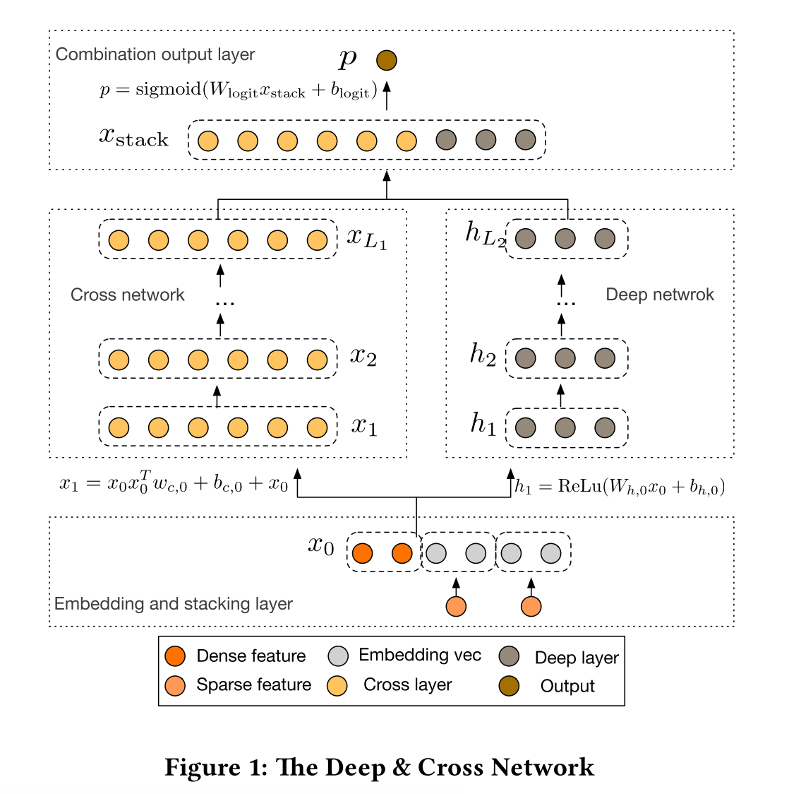
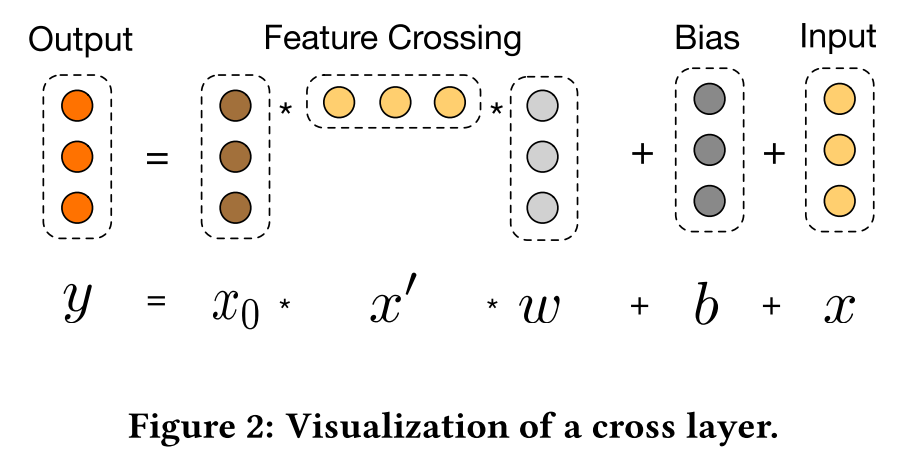
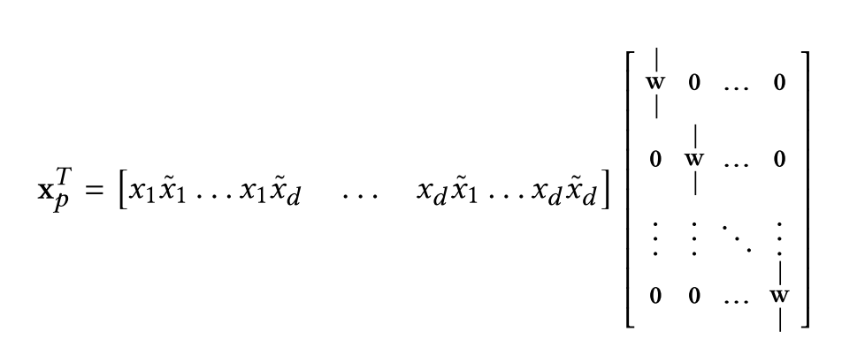

# DCN (Deep & Cross Network)

## 基本结构

我们先看看DCN的整理结构：

下面将其分为三部分去详细讲

### Embedding and Stacking Layer

该层将原始特征进行embedding和拼接：对于稀疏特征（一般是onehot出来的），进行embedding；稠密特征直接放进去

所以$$x_0$$为：

$$x_0 = \left[ x^T_{embed, 1},...,x^T_{embed, k},x^T_{dense} \right]$$

这里的$$k$$是稀疏特征的数量，注意最后有一个稠密特征的$$X$$

### Cross Network

这个部分即为DCN的核心部分，我们可以先这么理解，这一层干的事情相当于把DeepFM的FM部分改成了High-Order FM

这一层的公式为：

$$x_{l+1} = x_0 x_l^T W_l + b_l + x_l = f(x_l, W_l, b_l) + x_l$$

是不是看起来很像残差网络，$$f(x_l, W_l, b_l)$$就是在拟合残差$$x_{l+1} - x_l$$

下图展示了具体如何得到$$x_{l+1}$$

这里的参数数量是$$d \times L_c \times 2$$，其中，$$d$$是输入特征维度，$$L_c$$是层数

（这里为什么不是$$d \times d \times L_c \times 2$$？是因为，可以先算$$x^T_l W_l$$，得到$$1 \times 1$$的阵）

另外，这一层表达了High-Order FM，第$$l$$层表达了{l+1}-way的FM，具体原因后面详解

### Deep Network

这个部分就是几层全连接层，公式为：

$$h_{l+1} = f(W_l h_l + b_l)$$

这里的$$f(\cdot)$$是ReLU

这一层的参数数量是$$d \times m + m + \left( m^2 + m \right) \times \left( L_d - 1 \right)$$

## Cross Network详解

符号定义：$$w_j$$的第$$i$$个元素为$$w_j^{(i)}$$；对于$$\alpha = \left[ \alpha_1, ..., \alpha_d \right] \in \mathbb{N}^d$$，我们定义$$\lvert\alpha\rvert = \sum\limits^d_{i=1}\alpha_i$$，下面$$\alpha$$的作用就是表示特征的次方和，也就是用来表达特征多项式的度（degree of polynomial term）

下面都先省略bias，即$$b_i = 0$$

### Polynomial Approximation

我们先看看变量数为$$d$$，度为$$n$$多项式的公式：

$$P_n(x) = \left\{ \sum\limits_{\alpha} w_{\alpha} x_1^{\alpha_1} x_2^{\alpha_2} ... x_d^{\alpha_d} \mid 0 \leq \lvert\alpha\rvert \leq n, \alpha \in \mathbb{N}^d \right\}$$

我们再看到{i+1}-th层：$$x_{i+1} = x_0 x^T_i w_i + x_i$$，定义$$g_l(x_0) = x^T_i w_i$$，得到

$$g_l(x_0)  = \left\{ \sum\limits_{\alpha} c_{\alpha} \left( w_0, ..., w_l \right) w_{\alpha} x_1^{\alpha_1} x_2^{\alpha_2} ... x_d^{\alpha_d} \mid 0 \leq \lvert\alpha\rvert \leq l + 1, \alpha \in \mathbb{N}^d \right\}$$

（我们先不细究$$c_{\alpha}$$是什么，以及具体如何推导，这个细节请参考论文）

$$g_l(x_0)$$相当于多项式$$P_{l+1}(x)$$，也就是相当于{l+1}-way的FM

### Generalization of FM

DCN扩展了FM，能够得到High-Order的FM（由Cross Network的深度决定）

我们回顾一下公式：$$x_{l+1} = x_0 x_l^T W_l + b_l + x_l$$

前面讲了$$x^T_i w_i$$相当于{l+1}-way的FM，而$$x_l$$拟合了0-way到l-way的FM，所以$$x_{l+1}$$就拟合了0-way到{l+1}-way的FM，每增加一层就多拟合了一项高阶FM

（这里我有一点困惑了，$$x^T_i w_i$$相当于{l+1}-way的FM，那又乘了一个$$x_0$$不是就变成{l+2}-way的FM了？所以我觉得是$$x_0 x^T_i w_i$$相当于{l+1}-way的FM）

### Efficient Projection

考虑$$\tilde{x} \in \mathbb{R}^d$$作为输入，$$x_p = x_0 \tilde{x}^T w$$作为输出，那么

前半部分产生了$$d^2$$个$$x_i \tilde{x_j}$$的对，注意这里的$$w \in \mathbb{R}^d$$在后半部分都是一列一列的

所以DCN将交叉的部分做了压缩，最终输出的不是$$d^2$$个数，而是$$d$$个数，这样做使整体效率更高

# 参考

[Deep & Cross Network for Ad Click Predictions](https://arxiv.org/pdf/1708.05123.pdf)

