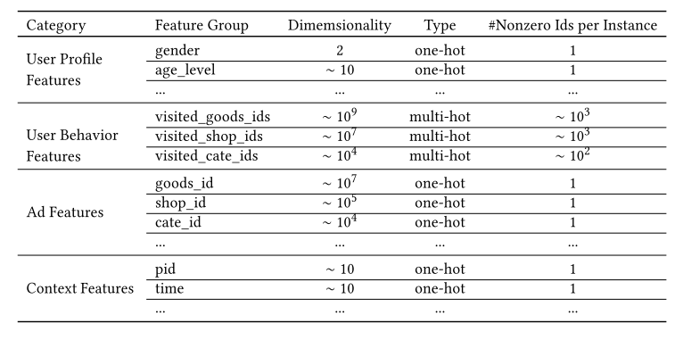
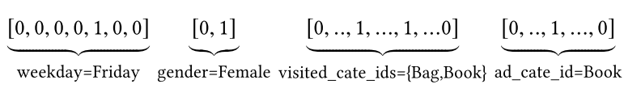
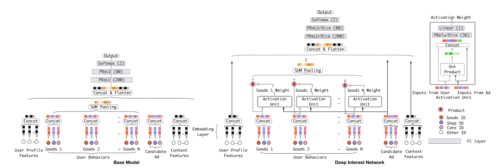
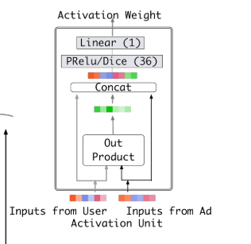
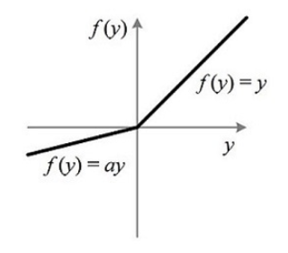
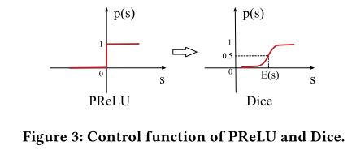

# DIN (Deep Interest Network)

DIN (Deep Interest Network)是阿里应用于电商的点击率预估算法，主要思路是建立用户历史浏览记录和待展示广告间的联系，并提出一种基于mini-batch的正则方法和一种激活函数Dice

## DIN结构

电商场景的的特征包括用户画像、用户行为、广告特征、上下文特征：

其中，性别等特征是进行one-hot的，即所有性别可能性中，只会出现一个1，性别不可能是多值的，而用户的历史浏览记录可能是多值的，那么通常就进行multi-hot，如下图所示：

在大部分点击率算法中，会对multi-hot进行聚合（比如求平均），然后所有特征concat后进全连接层，这里对这一类算法统称为Embedding&MLP，下图左边就是这一类算法：

这类算法包括：LR、Wide&Deep、PNN、DeepFM，这里需要注意的是虽然DeepFM使用的FM交叉项的设计，但是对于multi-hot特征还是会先进行聚合（也可以称作pooling）

这样直接将multi-hot特征进行聚合会损失很多信息，DIN以这个为切入点做了优化设计。我们看到上图的右边，就是DIN的结构，它将每种用户行为都跟候选广告进行交叉计算（具体如何计算下面说），即图中的Activation Unit，通过了这个单元后，会出来一个权重，也就是说对于不同的候选广告，用户历史行为的权重不同，然后进行加权求和。这个在业务上也很说的通，比如一个女性经常看衣服，这时候展示衣服还是电子产品，两者的权重肯定是不同的。这种思路有点像NMT领域的Attention。其实我感觉，这个跟FM很像，只不过FM对所有特征都交叉（multi-hot特征聚合后成为一个embedding），而CIN就是先不对用户行为做聚合，而是先跟候选广告做一次交叉后再聚合。

## CIN Activation Unit

接下来看用户行为跟候选广告具体如何进行交叉并得到权重的

CIN是将两个向量做外积并铺平，然后跟两个向量一起进行concat后再接全连接层，这里全连接层的激活函数使用了Dice（下面具体介绍），我感觉借鉴了FM和PNN
的思想。从Activation Unit出来以后每个用户行为向量就都得到了一个权重，跟原始向量加权求和，这里跟Attention的思路很像。

论文中也提到了，他们也尝试使用了LSTM的结构去放在用户历史行为轨迹上，但是效果一般，猜测可能是因为人的兴趣变化太快（起意和兴趣消失很快），对于序列的数据来说是一种噪音

## Mini-batch Aware Regularization

很多特征的枚举值非常多，比如商品，可能会有上亿，再进行embedding后参数数量就会非常大，这样我们进行L2正则的时候，计算的代价难以接受

正常的正则是计算每条记录的正则，在稀疏特征下只计算有值的参数的正则

CIN提出使用mini-batch aware的正则，具体的做法就是对于一个batch，只要某个特征非0就计算他的正则

他们的区别就是正常的正则会多次计算在一个batch中多次出现的参数，而CIN提出的方案是同一个参数只会计算一次，也就是聚合的级别从记录变成batch

## Dice

PReLU的公式为：

$$
f(s) = 
\begin{cases}
s &if\ s \gt 0 \\
\alpha s &if\ s \leq 0 \\
\end{cases}
$$

一般$$\alpha$$是比1小的值，PReLU如下图所示：

PReLU的公式也可以写作：

$$f(s) = p(s) \cdot s + (1-p(s)) \cdot \alpha s$$

这里$$p(s)=I(s\gt 0)$$，也就是下图的左边：

而Dice的$$p(s)$$如上图右边所示，它的公式是：

$$p(s) = \frac{1}{1+e^{ -\frac{s-E[s]}{\sqrt{Var[s]+\epsilon}} }}$$

这里的$$E[s]$$和$$Var[s]$$是mini-batch内的均值和方差，它的思路就是使用均值和方差校准输入

但这里我有一个疑惑，Dice实际上还是sigmoid的结构，那是不是仍然会出现sigmoid在两端梯度很小下降很慢的缺点？

# 参考

[Deep Interest Network for Click-Through Rate Prediction Guorui](https://arxiv.org/pdf/1706.06978.pdf)

