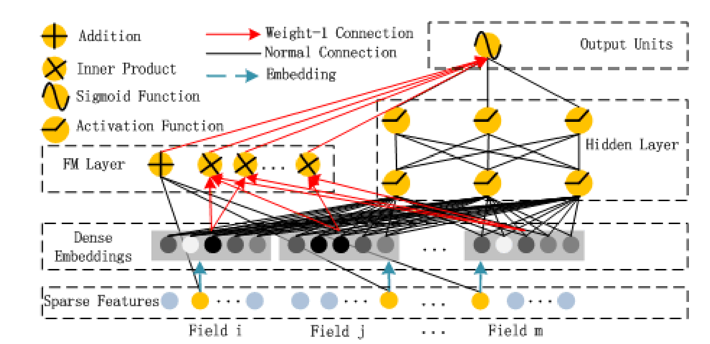
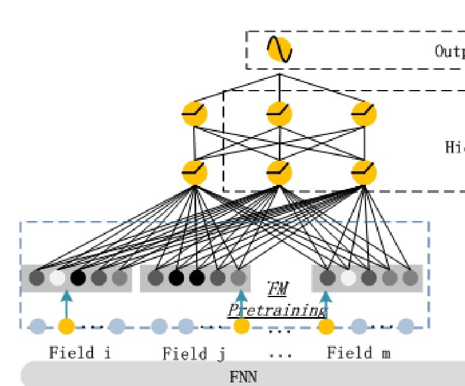
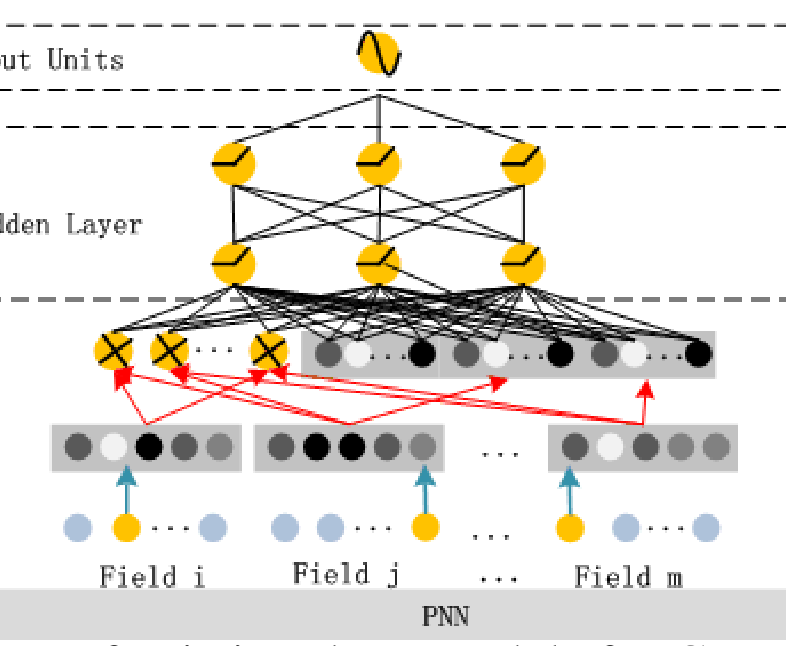
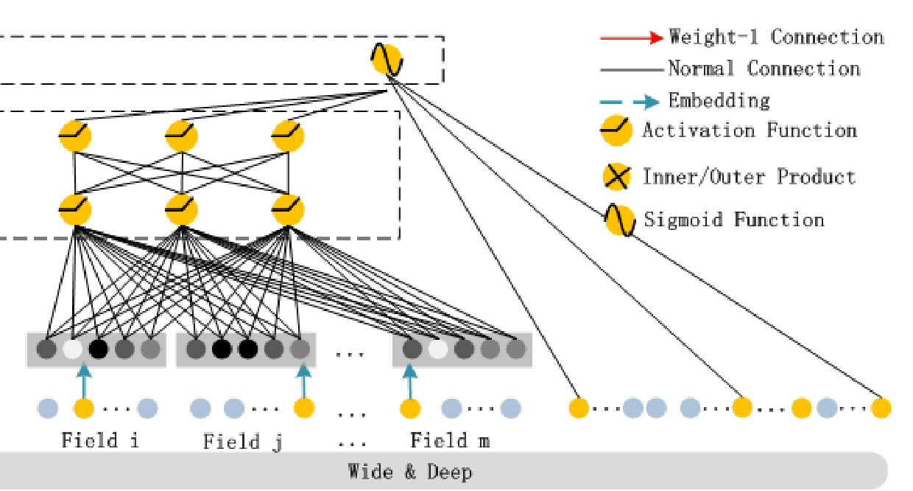
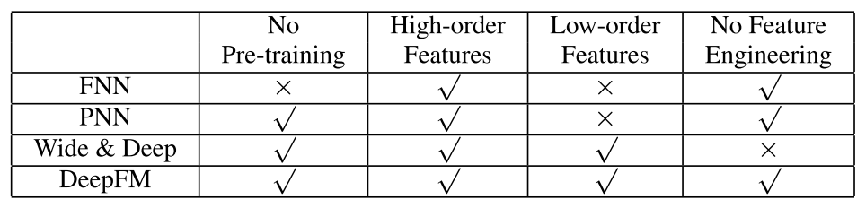

## DeepFM

### DeepFM结构

使用了hidden layer（high-order feature）以及FM layer（原始特征和交叉特征）

可以理解为Wide&Deep中的LR换成FM，但是FM跟Deep的Embedding的参数是共享的

### 对比FNN结构

1. FNN的embedding是使用FM预训练的，由于不是端对端的学习，这样会使效果严重依赖FM的训练效果
2. FNN只用了high-order特征，没有使用low-order特征（就是原始特征）

### 对比PNN结构

1. PNN使用了embedding的inner/outer product，有三种变形：IPNN，OPNN，PNN*，即使用了inner product，outer product，两种都使用
2. 只用了high-order特征，没有使用low-order特征

### 对比Wide&Deep

1. 使用了high-order和low-order特征，使用了交叉特征（但是需要手动特征工程在Wide部分交叉）
2. 需要手动交叉特征

### 三者对比

## 参考：

[paper link](https://www.ijcai.org/proceedings/2017/0239.pdf)