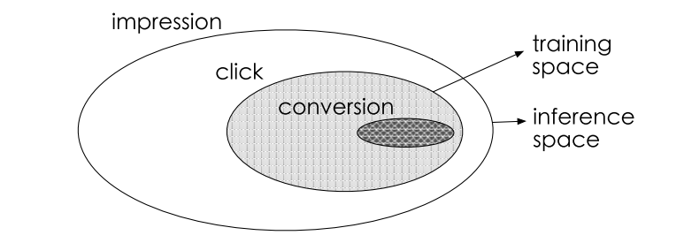
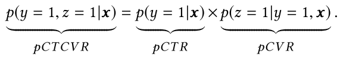
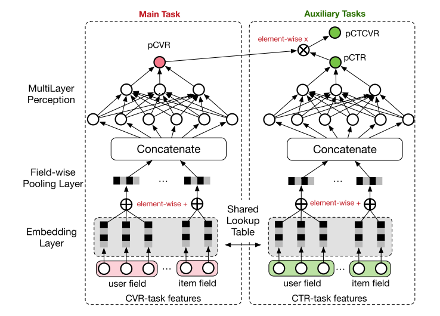
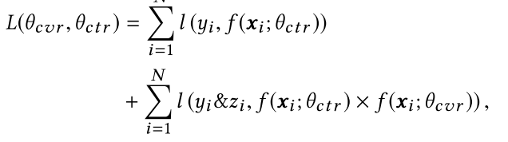

# ESMM (Entire Space Multi-Task Model)

ESMM使用了多任务学习解决了CVR预测的bias问题，该算法由阿里巴巴提出。

## CVR预测的挑战

* sample selection bias(SSB)问题

由于只有用户进行了点击，才能有后续的转化行为，所以我们会使用点击数据进行CVR的训练，但这样就会造成模型有偏，下图说明了该问题：

也就是说，用户没有点击的数据也可能产生转化，但我们无法得知，那这部分数据实际就浪费了。

* data sparsity(DS)问题

CTR模型通常使用曝光数据训练，所以CVR的训练数据会远小于CTR，这就造成了数据稀少的问题

## 进行多任务学习

### 公式定义

假设$$x$$是特征，$$y$$是是否点击，$$z$$是是否转化，那么：

另外，文中提到，$$pCTCVR$$和$$pCTR$$是对post-view数据建模的，$$pCVR$$是对post-click数据建模的，我查了下这两者的区别：

**Post Click Conversions**是指用户点击并转化发生在展示的这个广告上

**Post View Conversions**是指用户用户未点击展示的广告，但是在一定的时间窗口内又返回网站进行了转化

所以，我是这么理解的，$$pCTCVR$$涵盖了用户未点击广告但是进行了转化的情况（这样就能利用全量数据了，下面会详细解释）。

### 网络结构

然后，ESMM以$$pCVR$$为主任务，以$$pCTCVR$$和$$pCTR$$为辅助任务（Auxiliary Tasks），进行了如下的建模：

我们最终想要的是$$pCVR$$，但它在网络中只是一个临时变量，最后我们只会将$$pCTCVR$$和$$pCTR$$加入损失函数中。为什么这么做呢，因为这样子就可以用全量的数据了（即Entire Space），我们知道全量数据的点击情况，我们也知道全量数据曝光到转化的情况（包括中间未点击的），但是我们不知道全量数据点击到转化的情况，那么将CVR作为中间变量，我们就可以忽略掉这个问题了。
我们将loss公式化后：

另外要提一下的是，左右两边的Embedding是共享参数的，这样就解决了CVR数据稀少造成参数训练不足的问题。

# 参考

[Entire Space Multi-Task Model: An Effective Approach for Estimating Post-Click Conversion Rate](https://arxiv.org/pdf/1804.07931.pdf)
