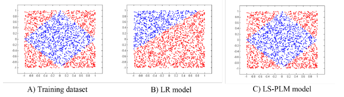

# MLR / LS-PLM

MLR (mixed Logistic Regression)，又叫LS-PLM (Large Scale Piecewise Linear Model)

MLR主要是为了解决LR无法很好的拟合非线性可分数据而被提出的，从2012年还是就在阿里开始使用

MLR和普通的LR的对比效果如下：

## MLR公式

MLR使用了分而治之的思路，划分了m个区域，然后每个区域中都进行LR，这里的m个区域数量是自己设置的，区域的范围相当于隐变量，也是要求解的

这个思路的公式化的表达为：

$$p\left( y=1 \mid x \right) = g\left( \sum\limits^m_{j=1} \sigma(u^T_jx) \eta(w^T_jx) \right)$$

$$\sigma(\cdot)$$是划分函数，对于一个样本$$x$$被分到每个区域的概率，$$\eta(\cdot)$$是拟合函数，就是在每个区域中为正样本的概率。$$g(\cdot)$$使模型满足概率函数。

特别的，让$$\sigma(\cdot)$$为softmax，让$$\eta(\cdot)$$为sigmoid，$$g(x)=x$$，则概率公式为：

$$p\left( y=1 \mid x \right) = \sum\limits^m_{i=1} \frac{exp(u^T_ix)}{\sum^m_{j=1}exp(u^T_jx)} \cdot \frac{1}{1+exp(-w^T_ix)}$$

为了防止过拟合，并且是参数更稀疏，增加了正则项，所以目标函数为：

$$
\begin{align}
&\mathop{\arg\min}_{\Theta} f(\Theta) = loss(\Theta) + \lambda \lVert\Theta\rVert_{2,1} + \beta \lVert\Theta\rVert_1 \\
&loss(\Theta) = -\sum\limits^n_{t=1}\left[ y_t log(p(y_t=1 \mid x_t,\Theta)) + (1-y_t) log(p(y_t=0 \mid x_t, \Theta)) \right] \\
\end{align}
$$

这里的$$\lVert\Theta\rVert_{2,1} = \sum^d_{i=1}\sqrt{\sum^{2m}_{j=1}\theta^2_{ij}}$$，是为了特征选择；$$\lVert\Theta\rVert_1 = \sum_{ij} \lvert\theta_{ij}\rvert$$是为了稀疏性

## 最优化目标函数

由于目标函数非凸且无法求导，所以MLR提出了使用右导数进行最优化

# 参考

[Learning Piece-wise Linear Models from Large Scale Data for Ad Click Prediction
Kun](https://arxiv.org/pdf/1704.05194.pdf)

