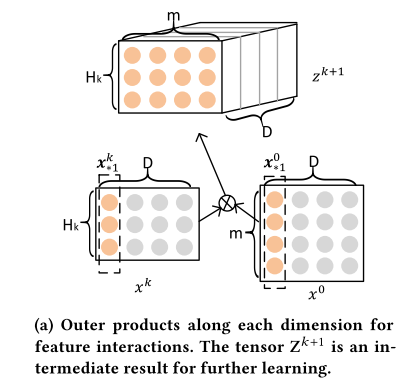
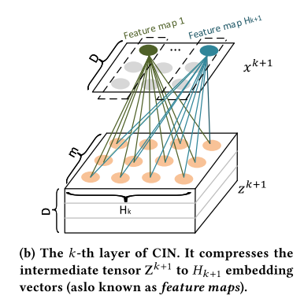
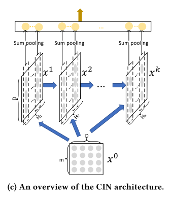
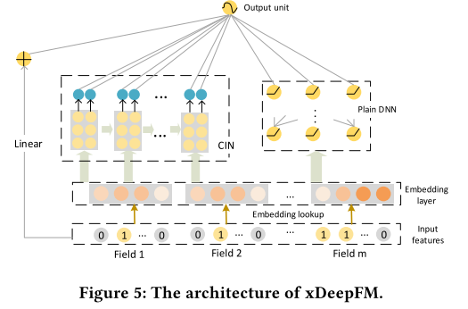

# xDeepFM / CIN

eXtreme Deep Factorization Machine (xDeepFM) 提出了一种新的网络Compressed Interaction Network (CIN)，在DCN的基础上进一步提升了基于FM的深度学习结构

xDeepFM的改进点主要是：DCN的交叉是bit-wise，而CIN的交叉是vector-wise的。bit-wise是指将所有特征embedding后放到一个向量中，即同一个特征embedding的每个元素进到DCN网络后都是一个"新的特征"，同一个embedding的各个元素也会交叉；而vector-wise是指将所有特征embedding后，每个特征都是一个向量，即有一个field的概念，进入CIN后是embedding向量与向量间的交叉

## CIN结构

我们先看看CIN怎么做vector-wise product的：

图中的$$x^0$$是最开始的特征，大小为$$m \times D$$，$$m$$是特征数，$$D$$是embedding维度数；$$x^k$$都是CIN的中间过程，大小为$$H_k \times D$$，$$H_k$$是自己设定的，代表中间层隐含的特征数。$$z^{k+1}$$是根据$${x^k}$$和$$x^0$$得到的，是第k层和第0层在D上的每个维度的外积，这样就是vector-wise的，因为每个embedding的每个元素是一一对应相乘的，然后因为做了外积，所以得到了第k层和第0层每个特征embedding之间的乘积（第1层是第0层跟第0层做外积，相当于FM的交叉部分了）

这样得到的$$z^{k+1}$$还需要进行压缩（否则形状就无法进行下一次迭代了）：

可以看到图中将$$z^{k+1} \in \mathbb{R}^{H_k \times m \times D}$$压缩到了$$x^{k+1} \in \mathbb{R}^{H_{k+1} \times D}$$，这样就可以继续进行下一次迭代了

计算公式为：

$$X^k_{h,*} = \sum\limits^{H_{k-1}}_{i=1} \sum\limits^m_{j=1} W^{k,h}_{ij} \left( X^{k-1}_{i,*} \circ X^0_{j,*} \right)$$

CIN整体结构：

可以看到CIN不断从上一层和第0层得到新的一层，有点像RNN的结构，通过这种设计得到了High-Order的FM。这里跟DCN不同的是，DCN每一层是1阶到k阶所有的项，而CIN每层就是k阶的项，所以这里做了sum pooling，把所有阶输出到一个全连接层，得到最终的High-Order的FM

## CIN复杂度分析

CIN参数量为：$$\sum^T_{k=1} H_k \times (1 + H_{k-1} \times m)$$

所以空间复杂度为：$$O(mTH^2)$$（假设每层的$$H_k$$一样，$$T$$就是层数）

作为对比，DNN部分的空间复杂度为：$$O(mDH+TH^2)$$

时间复杂度为：$$O(mH^2DT)$$，作为对比，DNN部分时间复杂度为：$$O(mHD+H^2T)$$

所以CIN的瓶颈在时间复杂度上，他的复杂度比DNN部分还要高

## xDeepFM整体结构

最左边是Linear部分，中间是CIN部分，最右边是DNN部分，其他的分布跟DCN一样，变化的地方就是CIN

# 参考

[xDeepFM: Combining Explicit and Implicit Feature Interactions for Recommender Systems](https://arxiv.org/pdf/1803.05170.pdf)
