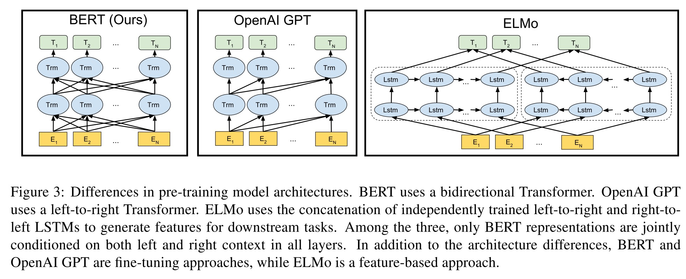
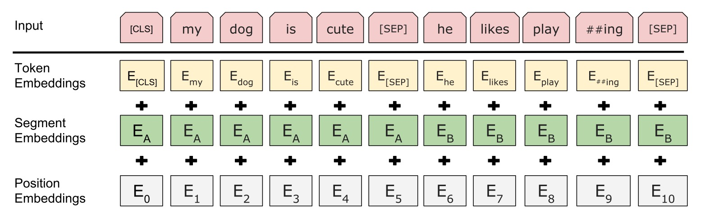

# BERT

## 简介

NLP通常用预训练的语言表达来给下游使用，有两种常用的预训练的语言表达方式：feature-based和fine-tuning。feature-based方法，比如ELMo，将预训练好的词向量以及结构作为下游任务特征的一部分，下游任务的结构可以自定义，只要把ELMo的部分包含进去就行了（参数用预训练好的）。fine-tuning方法，比如GPT，将模型整体结构训练好，这个结构就不动了，下游任务按照它提供的方式组装，然后进行fine-tune。BERT属于fine-tuning类型的方法。

BERT的特点已经写在了它的名字中：Bidirectional Encoder Representations from Transformers。BERT是双向的，作为对比GPT是单向的，这是BERT的一个改进点，使用双向进行预训练效果会更好。使用了Transformer，比LSTM特征提取能力更强。另外BERT还使用了mask的方法进行训练，称为MLM（masked language model）。

下面将BERT分为pre-training和fine-tuning两个部分说明。pre-training表示预训练阶段，使用未标注的数据进行训练。fine-tuning表示微调阶段，使用预训练好的参数初始化模型，然后根据下游任务的标注数据进行微调。

## 结构

BERT的结构跟GPT和ELMo结构的对比图如下：

ELMo使用的两个单向LSTM的提取器，GPT使用了单向的Transformer。而BERT使用了双向的Transformer。Transformer的一些细节可以看[这里](./transformer.md)，其实BERT和GPT的Transformer就用了encoder部分。

假设$$L$$是Transformer的层数，$$H$$是隐藏层大小（也是embedding大小），$$A$$是multi-head的数量。BERT-BASIC结构的参数为：$$L=12, H=786, A=12$$；BERT-LARGE结构的参数为：$$L=24, H=1024, A=16$$。

## Pre-training

BERT用了MLM和NSP两种方法进行预训练。

### Masked LM（MLM）

通常的LM（language model）使用从左到右或者从右到左的方式提取特征，也就是逐次预测下一个词是什么，这是单向模型的模式（从Transformer的理论来看，就是要以这种方式训练）。

那么怎么才能进行双向的训练呢？MLM使用了mask的方式，就是把一整句话中15%的词替换成[MASK]的标记，然后预测[MASK]掉的地方，很像W2V中CBOW的方式。不过这里还有一个问题，在我们微调的时候，并没有[MASK]这个概念，而预训练时候会有很多[MASK]，所以预训练和微调的任务上就是有差别的。为了缓解这个问题（注意不是解决，而仅仅是缓解），BERT将mask掉的15%的词，其中80%用[MASK]标记代替，其中10%随机换成其他的词，10%不做改变（其实这里让我很费解，为什么会缓解，我暂时没找到让我满意的答案）。

### Next Sencent Prediction（NSP）

语言模型通常对于两个句子的关系没有理解能力（因为训练是没有提供这些数据），所以BERT就把这部分数据加入到了训练。NSP指的就是预测下一个句子，可以是Q&A这种。具体的预测结构如下图：

[CLS]表示分类问题的一个token，[SEP]表示句子间的分割token，最终模型的输出就是0或者1。可以看到，该任务中，还有位置embedding和句子的embedding。

### 训练数据

论文提到一个细节，它使用wikipedia的时候只用了章节的文档，没有使用如标题、表格等文档，这让训练数据句子更加连贯。

### 训练超参

**batch_size**: 256 sequences (256 sequences * 512 tokens = 128000 tokens/batch)

**step_size**: 1000000 steps (约40 epochs)

**optimizer(Adam)**: 学习率1e-4线性衰减，warmup 10000 steps，$$\beta_1=0.9, \beta_2=0.999, L2=0.01$$

（注意L2这里论文是说L2 weight decay of 0.01，意思是用AdamW L2=0.01？还是指L2参数要衰减？）

激活函数用了GELU（而非RELU）。

## Fine-tuning

微调方法其实跟NSP的方法类似，input第一个token放上[CLS]，然后输出的第一个token就是一个分类问题的输出。

假设最后一层隐藏层输出的第一个向量为$$C \in \mathbb{R}^H$$（也就是对应着[CLS]的隐藏向量），分类问题的参数为$$W \in \mathbb{R}^{K\times H}$$，其中$$K$$是分类问题label数量，然后做一个分类问题的损失，进行训练即可。

### 微调超参

大部分参数跟训练一样，除了下面几个参数值效果更好：

* **batch_size:** 16, 32
* **learning_rate:** 5e-5, 3e-5, 2e-5
* **number of epochs:** 2, 3, 4

# 疑问

* BERT可以生成式么（比如翻译）？问答的任务只能用候选句子一个个判断么？如果可以，下游怎么fine-tuning

# 参考

[BERT: Pre-training of Deep Bidirectional Transformers for Language Understanding](https://arxiv.org/pdf/1810.04805.pdf)
