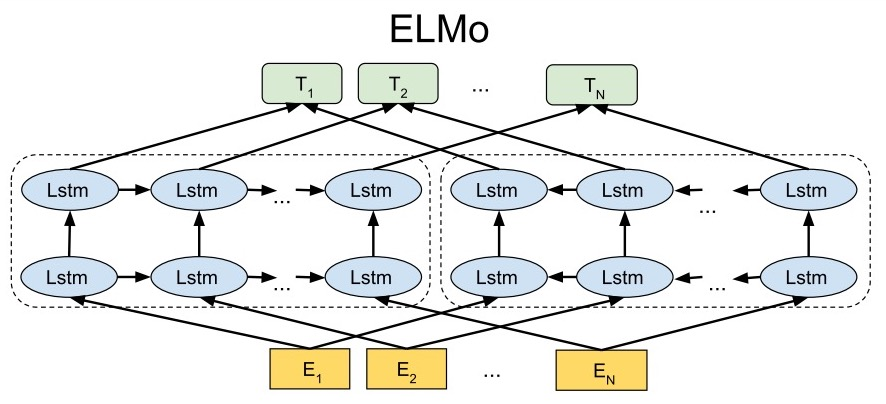

# ELMo (Embeddings from Language Models)

Word2Vector的词向量对于多义词无法太好的分辨，ELMo为了解决这个问题加入了能够利用文本顺序的结构。
另外，Word2Vector是将预训练后的词向量作为特征提供给下游模型，而ELMo是对整个输入句子的表达，然后将这个表达加入到特征中（有点像提供了一个函数，这个函数对整个句子进行描述，产生向量，给下游使用）。

## 结构

### Bidirectional language models (bi-LM)

bi-LM其实就是分成两个分支，一个提取前向特征，一个提取后向特征，下图展示了这一过程：

我们将这个过程公式化，给定一个包含N个token的序列：$$(t_1, t_2, ..., t_N)$$，前向的语言模型每次根据历史的词$$(t_1, ..., t_{k-1})$$预测下一个词$$t_{k}$$，那么输出整个序列的概率就是：

$$p(t_1, t_2, ..., t_N) = \prod\limits^N_{k=1} p(t_k \mid t_1, ..., t_{k-1})$$

假设这个前向的语言模型使用的是$$L$$层的LSTM，那在第$$j$$层第$$k$$个位置的词的隐向量为$$\overrightarrow{h}^{LM}_{k,j}$$

类似的，反向的语言模型每次根据未来的词$$(t_{k+1}, ..., t_N)$$预测前一个词$$t_k$$，那么输出整个序列的概率就是：

$$p(t_1, t_2, ..., t_N) = \prod\limits^N_{k=1} p(t_k \mid t_{k+1}, ..., t_{N})$$

对应的隐向量为$$\overleftarrow{h}^{LM}_{k,j}$$

最后，bi-LM需要将这两部分合并起来，最大似然函数是：

$$\sum\limits^N_{k=1} \left( \log p(t_k \mid t_1, ..., t_{k-1}; \Theta_x, \overrightarrow{\Theta}_{LSTM}, \Theta_S) + \log p(t_k \mid t_1, ..., t_{k-1}; \Theta_x, \overleftarrow{\Theta}_{LSTM}, \Theta_S) \right)$$

其中，$$\Theta_x$$是token的表达，$$\Theta_S$$是输出token的softmax参数的表达，前向和后向的LSTM的分开的。

### ELMo

ELMo将bi-LM的中的表达合并后给下游使用。对于一个$$L$$层的bi-LM，总共有$$2L+1$$个表达：

$$
\begin{align}
R_k &= \left\{ x^{LM}_k, \overrightarrow{h}^{LM}_{k,j}, \overleftarrow{h}^{LM}_{k,j} \mid j = 1,...,L \right\} \\
&= \left\{ h_{k,j}^{LM} \mid j = 0,...,L \right\} \\
\end{align}
$$

其中，$$h^{LM}_{0,k}$$就是最开始token的表达，$$h_{k,j}^{LM} = \left[ \overrightarrow{h}^{LM}_{k,j} ; \overleftarrow{h}^{LM}_{k,j} \right]$$将两个方向的隐向量进行了拼接

然后，ELMo将中间所有的表达拿出来进行加权给下游使用（当然也可以只拿一分部，没拿的部分相当于权重是0），图示如下：

公式化后为：

$$ELMo_k^{task} = \gamma^{task} \sum\limits^L_{j=0} s_j^{task} h_{k,j}^{LM}$$

其中，$$s_j^{task}$$是softmax后的权重，这个是学习到的，$$\gamma^{task}$$是缩放因子，是一个超参，调整特征向量的尺度。这样就得到了一个加权后的向量作为下游的特征。

### 用于下游任务

假设下游任务有自己的结构提取句子的特征，可以是不带上下文信息的特征（比如word2vec），可以是带上下文信息的特征（比如RNN、CNN的输出）。将ELMo的参数冻住，然后将ELMo的输出和原本的特征拼接起来后作为新的特征。

### 预训练bi-LM

时间中ELMo选取了两层LSTM，然后第二层做了个残差网络。其他的参数我没有特别的理解，感觉需要看一下引用的论文，后面再补充。

# TODO

* 补充预训练bi-LM部分

# 参考

[Deep contextualized word representations
Matthew](https://arxiv.org/pdf/1802.05365.pdf)

[知乎-张俊林](https://zhuanlan.zhihu.com/p/49271699)
