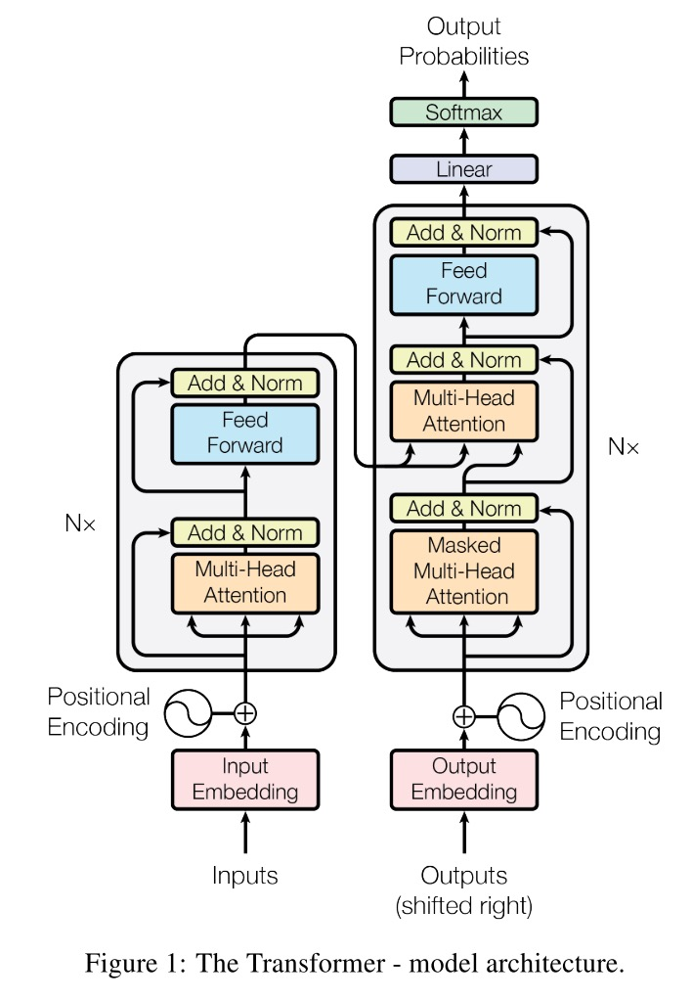
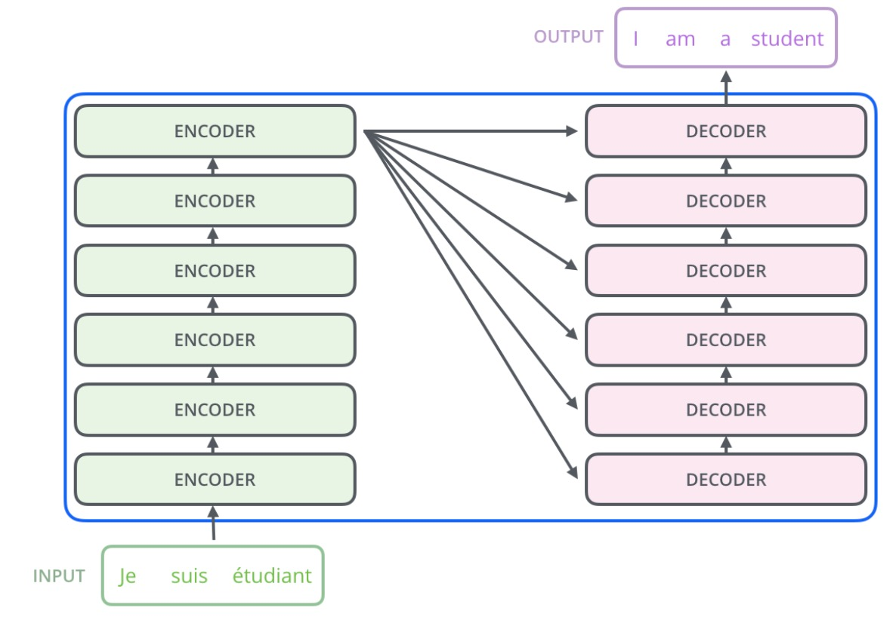
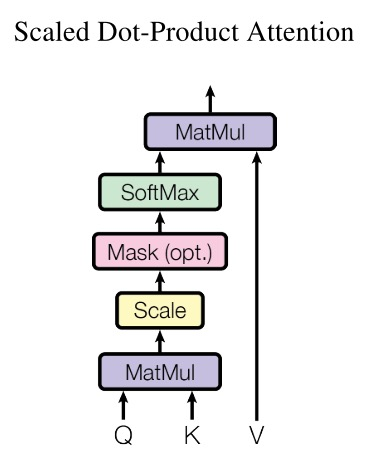
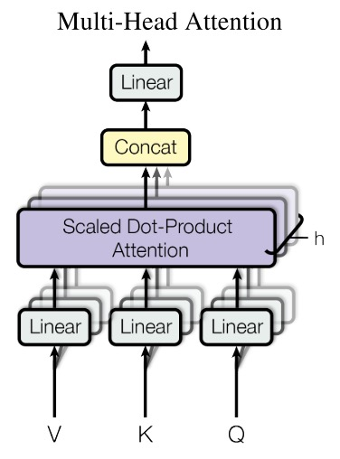
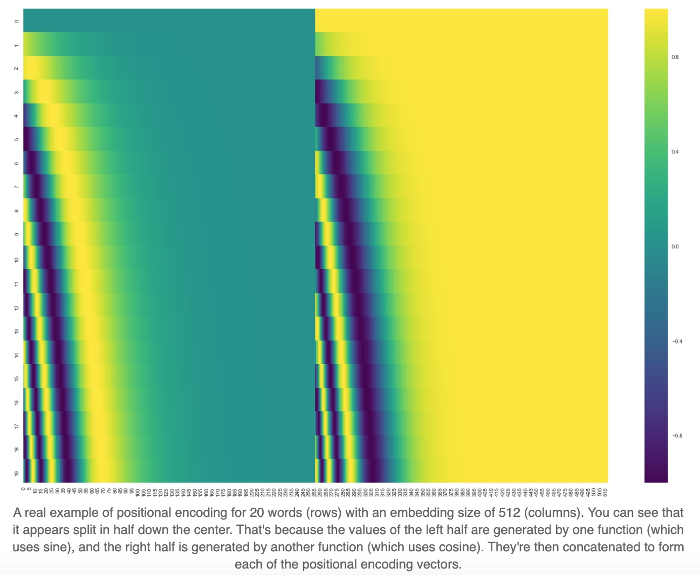
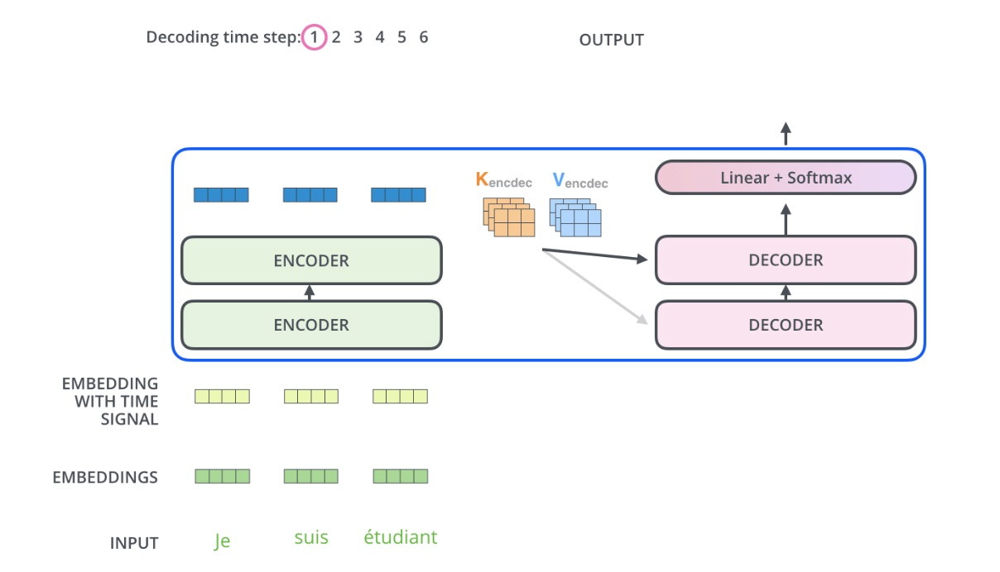
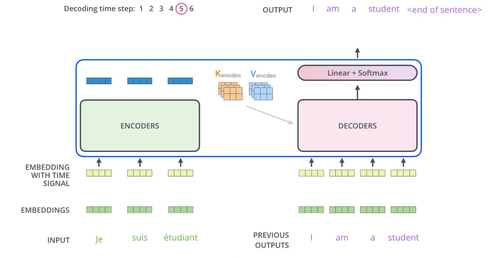

# Transformer

Transformer可以用作翻译，它很像Seq2Seq，给定一个句子，然后输出该句子的翻译，所以它也是有Encoder和Decoder部分，Encoder负责提取待翻译句子的特征，然后将特征传递给Decoder进行翻译，输出是生成式的，也就是一个一个词输出直到终止词出现。

论文首先吐槽了RNN并行计算困难的缺点，RNN计算时需要依赖前一个单元，也就是要顺序计算，这种情况并行是很困难的，虽然近几年提出了一些针对性的优化方案，但顺序计算对于计算的限制仍然是存在的。所以论文提出了使用attention的Transformer，它不需要顺序计算，更容易进行并行计算。

## 整体结构

我们先看一下Transformer的整体结构图：

左半边是Encoder部分，右半边是Decoder部分，接下来看看下面这些细节：

* Encoder和Decoder都有一个$$N\times$$的符号，代表了堆叠
* 橙色区域的Attention，包括Multi-Head Attention以及Masked Multi-Head Attention
* 蓝色区域的Feed Forward
* 浅黄色区域的Add & Norm
* 红色区域的embedding
* 跟在红色区域后面的Positional Encoding

### Encoder / Decoder 的堆叠

通常Encoder/Decoder的堆叠数量$$N=6$$，也就是他们各堆叠6层，具体的堆叠方式如下：

可以看到，对于每个Encoder，它的输入是上一个Encoder的输出（第一个Encoder输入是Input）；而对于Decoder，他的输入是上一个Decoder的输出以及最后一个Encoder的输出。

每个模块间的传递的向量长度为$$d_{model}=512$$，embedding的向量长度也是一样。

### Self-Attention

Attention就是对于每个输出词，都去看一下所有的输入词，有点像人翻译每个词的时候都把待翻译的句子看一遍。而Self-Attention的输入句子和输出句子是一样的，有点像人把一个句子反复看，然后提取要点。

#### Scaled Dot-Product Attention

Attention的输入通常由三部分组成：Query、Key、Value，Query代表输出词，Key代表输入词，Value代表输入词指，他们都是向量。Attention的做法是算出Query跟Key的相似度，再乘上Value（注意这里的Key是输入句子的所有词，最终要求加代表Query跟输入句子的Attention），，即

$$Attention(Query, Source) = \sum\limits_{i\in Source}Similarity(Query, Key_i) \times Value_i$$

计算相似度可以有很多方法。

Transformer使用的Attention结构如下：

公式化的表达为：

$$Attention(Q, K, V) = softmax(\frac{QK^T}{\sqrt{d_k}}) V$$

这里的$$\sqrt{d_k}$$是缩放因子，论文中提到，加入缩放的原因是，没有加入缩放的Dot-Product Attention效果不如Additive Attention，怀疑是因为内积以后的值太大，后面又跟了softmax，导致了梯度太小。注意这里的QKV都是矩阵，是因为在实际实现中，都是一整个批次的进行矩阵运算（而不是一个一个向量进行计算）。

#### Multi-Head Attention

Transformer没有直接将QKV（大小为$$d_{model}$$）直接输入到单个Attention中，而是使用了更有效的Multi-Head，将QKV进行线性变换（变换大小为$$d_k$$）后再进行Attention，这种方式重复$$h$$次，然后concat起来作为输出。结构图如下：

公式化的表达为：

$$
\begin{align}
MultiHead(Q, K, V) = Concat(head_1, ..., head_h)W^O \\
where \ head_i = Attention(QW_i^Q, KW_i^K, VW_i^V) \\
\end{align}
$$

这里的$$W_i^Q \in \mathbb{R}^{d_{model}\times d_k}$$，$$W_i^K \in \mathbb{R}^{d_{model}\times d_k}$$，$$W_i^V \in \mathbb{R}^{d_{model}\times d_v}$$，$$W_i^O \in \mathbb{R}^{hd_v \times d_{model}}$$

$$h$$取8，所以$$d_k = d_v = d_{model} / h = 8$$，由于线性变换后的维度变小了，所以整体上Multi-Head的方法跟使用单个Attention计算量不会差很多。

#### Mask

在Decoder部分，Attention是Masked，也就是，在计算输出句子第$$i$$个词时，只看这个词之前的词（到第$$i-1$$为止的词）。具体做法是，将每个词之前的Attention值置为负无穷，这样进入softmax后就是0了。

### Position-wise Feed-Forward

这里其实就是做了一个全连接层，使用了RELU作为激活函数，再接一个全连接，公式为：

$$FFN(x) = max(0, xW_1+b_1)W_2 + b_2$$

另外，这个参数在同一个子Encoder中对于每个词是共享的（这也许就是Position-wise的含义）。

### Add & Norm

这里是将X和Attention后的X相加（也就是残差网络），然后进行标准化。（看参考3的代码好像x先norm再attention，这里有一点疑问）

### Embedding

就是普通的Embedding，不过在Positional Encoding后的加权和，除以了$$\sqrt{d_{model}}$$。另外，我理解Encoder和Decoder的Embedding是共享的。

### Positional Encoding

由于Attention方法并不会考虑位置信息，所以Transformer用的方法是Positional Encoding，使模型会考虑位置信息。具体做法是，将所有位置编码，把这个编码加到原始embedding上去。

Positional Encoding的公式为：

$$
\begin{align}
PE_{(pos, 2i)} = sin(\frac{pos}{10000^{\frac{2i}{d_{model}}}}) \\
PE_{(pos, 2i+1)} = cos(\frac{pos}{10000^{\frac{2i}{d_{model}}}}) \\
\end{align}
$$

这里的$$pos$$代表词所在的位置，$$2i$$代表embedding中偶数位置的元素，$$2i+1$$代表奇数位置的元素。将PE可视化后：

## 整体流程

### Encoder

每个词都进入Encoder，整体输入句子有几个词，通过Encoder后还是有几个词（只是向量化了），这些向量最终会作为Decoder的一分部输入。

### Decoder

Decoder是运作方式是生成式的，每次生成下一个词，直到生成了一个终止词（这就是为什么要mask的原因）。生成的方式就是一个多分类，所以可以看到Decoder的输出后面跟了softmax，生成的这个词也会作为下一个词的输入。

## 损失函数

每次预测一个词时都是softmax，这时就可以做交叉熵损失了。但我还有一个疑问就是，比如期望输出的长度是x，而实际模型输出了y，那这种情况怎么做损失呢？

# TODO

一些细节还不确定，可能需要看看官方源码

* Add & Norm的顺序
* loss是什么

# 参考

[Attention Is All You Need](https://arxiv.org/pdf/1706.03762.pdf)

[jalammar github.io](https://jalammar.github.io/illustrated-transformer/)

[harvard edu (pytorch代码解析)](http://nlp.seas.harvard.edu/2018/04/03/attention.html)
