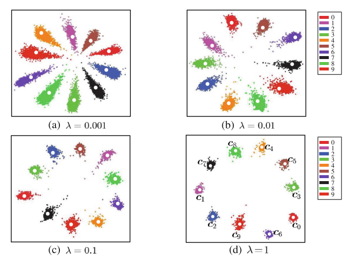
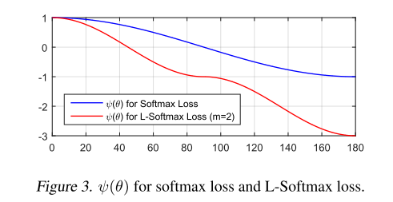
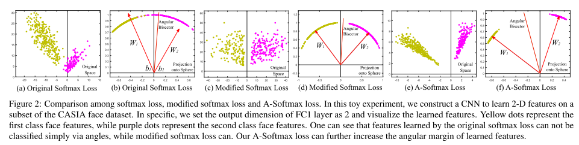
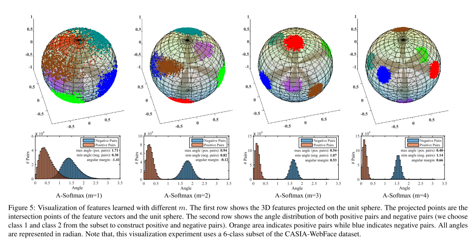
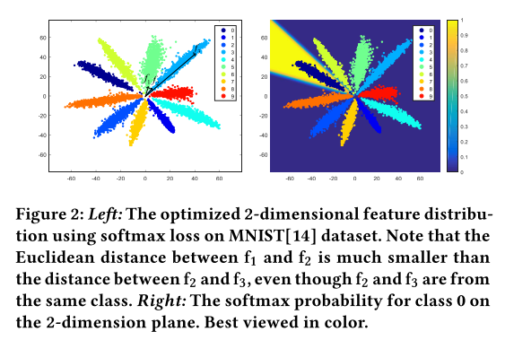
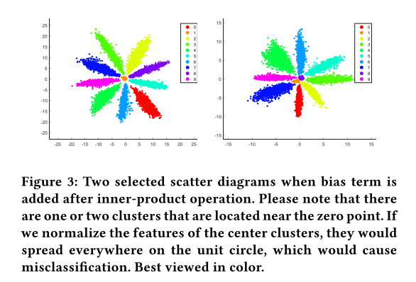
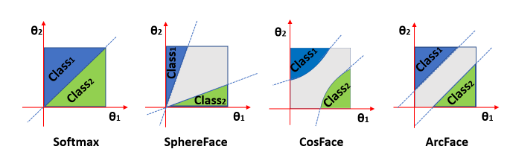

# metrics

1.FAR(False Accept Rate) 误识率：人脸对比通过但实际不是本人，把假的认成真的

2.VAL(Validation Rate) 通过率：两张图是同一个人，识别出也是同一个人

3.FRR(False Reject Rate) 拒真率：1-通过率，应该是本人但是人脸对比不通过，把真的认成假的

所有metrics都建立在阈值选取的基础上，跟阈值结合起来看才有业务上的意义

通常计算一定FAR下的VAL，比如facenet千分之一FAR下的VAL为98.64%

# feature extract

## HOG(Histogram of Oriented Gradients)

https://www.learnopencv.com/histogram-of-oriented-gradients/

# DeepLearning Loss Functions

## Triplet Loss (FaceNet)

a: anchor, p: positive, n: negitive

这里的$$f(x)$$是embedding

我希望a离p更近，且有一个margin，所以，

$$||f(x_i^p) - f(x_i^a)||_2^2 + \alpha < ||f(x_i^n) - f(x_i^a)||_2^2$$

所以损失函数是，

$$L = \sum\limits_{i=1}^m max(||f(x_i^p) - f(x_i^a)||_2^2 - ||f(x_i^n) - f(x_i^a)||_2^2 + \alpha, 0)$$

## Softmax Loss

将人脸识别视作多分类问题

这里的$$f(x)$$是embedding

$$
L = -\frac{1}{m}\sum\limits_{i=1}^m log \frac{e^{W^T_{y_i}f(x_i) + b_{y_i}}}{\sum\limits_{j=1}^n e^{W^T_j f(x_i) + b_j}}
$$

## Center Loss

这里的$$f(x)$$是embedding

Softmax部分，即多分类问题的损失:

$$
L = -\frac{1}{m}\sum\limits_{i=1}^m log \frac{e^{W^T_{y_i}f(x_i) + b_{y_i}}}{\sum\limits_{j=1}^n e^{W^T_j f(x_i) + b_j}}
$$

Center部分，距离对应中心的距离：

$$
L_C = \frac{1}{2} \sum\limits_{i=1}^m ||f(x_i) - c_{y_i}||_2^2
$$

Center Loss的想法是，不仅在多分类问题上分得准，而且要更紧凑：

$$
L = L_S + \lambda L_C
$$

最后一个问题就是如何更新中心了：

$$
c_j^{t+1} = c_j^t - \alpha \Delta c_j^t
$$

$$
\Delta c_j = \frac{\sum\limits_{i=1}^m 1\{y_i=j\} (c_j - x_i)}{1 + \sum\limits_{i=1}^m 1\{y_i=j\}}
$$

论文链接：http://ydwen.github.io/papers/WenECCV16.pdf

## L-Softmax (Large-Margin Softmax)

这里的$$x$$是embedding

直观理解，当$$f(x)$$属于分类1，而不属于分类2时，Softmax想让$$W_1^Tx >W_2^Tx$$，相当于$$\|W_1\| \|x\| cos(\theta_1) > \|W_2\| \|x\| cos(\theta_2)$$

那么，L-Softmax想让这个条件更严格一些，$$\|W_1\| \|x\| cos(m\theta_1) > \|W_2\| \|x\| cos(\theta_2), 0 \leq \theta_1 \leq \frac{\pi}{m}$$，也就是原本$$\theta_1$$达到的损失，现在$$\frac{\theta_1}{m}$$时就达到了，对于$$\theta_1$$的要求更高了

L-Softmax的定义：

$$
L_i = -log(\frac{e^{\|W_{y_i}\| \|x_i\| \phi(m\theta_{y_i})}}{e^{\|W_{y_i}\| \|x_i\| \phi(m\theta_{y_i})} + \sum\limits_{j \neq y_i} e^{\|W_j\| \|x_i\| cos(\theta_j)}})
$$

这里的$$\phi (\theta)$$的损失为：（具体公式参考论文）

论文链接：http://proceedings.mlr.press/v48/liud16.pdf

## A-Softmax (Angular Softmax, SphereFace)

这里的$$x$$是embedding

A-Softmax在L-Softmax的基础上，限定了$$\|W\|=1, b = 0$$，则$$W_1^Tx + b = \|W_1\| \|x\| cos(\theta_1) + b = \|x\| cos(\theta_1)$$，每个图片的$$x$$是相同的，所以实际上就是比较$$cos(\theta)$$。$$\|W\|$$与$$x$$角度越小，则余弦值越大，则softmax后的值越大。也就是说，与真实类别角度越小，最后的softmax出来的概率越大，分类问题跟余弦距离就契合上了（这时我们可以使用余弦距离评判人脸距离，不必使用欧几里得距离了）

我们可以看到A-Softmax使的类间距更小了，不对$$\|W\|$$进行norm，可能会使$$\|W\|$$变大从而降低损失，而不是$$cos(\theta)$$变大而降低损失

A-Softmax的定义：

$$
L_i = -log(\frac{e^{\|x_i\| \phi(m\theta_{y_i})}}{e^{\|x_i\| \phi(m\theta_{y_i})} + \sum\limits_{j \neq y_i} e^{\|x_i\| cos(\theta_j)}})
$$

另外需要注意在实践中的$$m$$设置，由于$$m$$是一个非常强的限制，在$$m=2$$时，它会认为距离真实分类仍有$$2\theta$$的角度，所以比较难优化。实践中，可以使用softmax + $$\alpha$$倍的A-Softmax，刚开始$$\alpha=0$$，后面慢慢变大

论文链接：https://arxiv.org/pdf/1704.08063.pdf

## NormFace

这里的$$f$$是embedding

NormFace在Softmax基础上，将embedding向量和W都标准化了，还去掉了bias，这时候softmax更加贴近余弦相似度了，文章分析了为什么会更贴近余弦相似度以及训练中可能会出现的坑

**不进行norm的缺点**

可以看到下图是直接使用softmax进行训练，$$f_1$$与$$f_2$$是不同类，但是距离更近，而$$f_2$$跟$$f_3$$是同类，但距离更远

另外，分类色块趋向于放射状，是由于softmax会通过增加$$f$$的大小来降低损失

如果我们不去掉bias，即$$\|b\|>0$$，那么在原点附近就会有分类聚集

**进行norm的问题：训练收敛失败**

单纯的将$$f$$，$$W$$都标准化，并取消bias，会无法收敛

原因是这样做会使$$Wx$$在$$[-1, 1]$$之间，也就是$$\frac{e^{W^T_{y_i}f_i}}{\sum\limits_{j=1}^n e^{W^T_j f_i}}$$无法收敛到接近1，所以需要将$$Wx$$乘以一个倍数，来让它收敛

所以NormFace的损失为：
$$
L_{S'} = -\frac{1}{m}\sum\limits_{i=1}^m log \frac{e^{sW^T_{y_i}f_i}}{\sum\limits_{j=1}^n e^{sW^T_j f_i}}
$$

s的取值详情见论文（类数量会影响s的取值）

**跟欧几里得距离的关系**

由于$$\|x-y\|^2_2=2-2x^Ty$$，所以可以将损失写为，

$$
L_{S'} = -\frac{1}{m}\sum\limits_{i=1}^m log \frac{e^{sW^T_{y_i}f}}{\sum\limits_{j=1}^n e^{sW^T_j f}}
= -\frac{1}{m}\sum\limits_{i=1}^m log \frac{e^{-\frac{s}{2}\|f_i - W_{y_i}\|_2^2}}{\sum\limits_{j=1}^n e^{-\frac{s}{2}\|f_i - W_j\|_2^2}}
$$

所以这个时间余弦相似度跟欧几里得距离实质是一样的

我们可以将$$\|f_i - W_j\|_2^2$$带入到contrastive loss或者triplet loss中，这样就解决了这两种loss是使用欧几里得距离的问题了（不过要注意margin的设置，具体可见论文）

论文链接：https://arxiv.org/pdf/1704.06369.pdf

## AM-Softmax (Additive Margin Softmax)

CosFace也是一样的思路

这里的$$f$$是embedding

AM-Softmax将$$f$$，$$W$$都标准化，并取消bias。特别的，它使用的margin方式是$$\phi(\theta) = cos(\theta) - m$$

所以最终的损失是：
$$
\begin{aligned}
& l_{AMS} = -log(\frac{e^{s\cdot (cos(\theta_{y_i}) - m)}}{e^{s\cdot (cos(\theta_{y_i}) - m)} + \sum\limits_{j \neq y_i} e^{s\cdot  cos(\theta_j)}}) \\
& \qquad = -log(\frac{e^{s\cdot (W_{y_i}^T f - m)}}{e^{s\cdot (W_{y_i}^T f - m)} + \sum\limits_{j \neq y_i} e^{s\cdot  W_{j}^T f}}) \\
\end{aligned}
$$

论文链接：https://arxiv.org/pdf/1801.05599.pdf

## ArcFace

这里的$$f$$是embedding

ArcFace将$$f$$，$$W$$都标准化，并取消bias。它使用的margin方式是$$\phi(\theta) = cos(\theta - m)$$

所以最终的损失是：

$$
l = -log(\frac{e^{s\cdot (cos(\theta_{y_i} + m))}}{e^{s\cdot (cos(\theta_{y_i} + m))} + \sum\limits_{j \neq y_i} e^{s\cdot  cos(\theta_j)}})
$$

我们可以将A-Softmax、AM-Softmax（CosFace）、ArcFace结合在一起：

$$
l = -log(\frac{e^{s\cdot (cos(m_1\theta_{y_i} + m_2) - m_3)}}{e^{s\cdot (cos(m_1\theta_{y_i} + m_2) - m_3)} + \sum\limits_{j \neq y_i} e^{s\cdot  cos(\theta_j)}})
$$

这里对比一下三者在几何学上的差别

论文链接：https://arxiv.org/pdf/1801.07698.pdf

