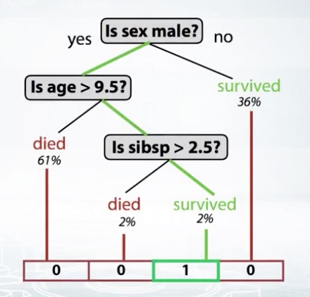

## 预处理
-----

### numerical features

* 归一化

* 异常点

  一些模型对异常点较敏感，所以需要处理异常点，可以进行裁剪（clip）或者排序（rank）
  
* 变换

  使数据更符合正太分布，然后在归一化更合理

  ```
  np.log(1 + x)
  np.sqrt(x + 2/3)
  ```
  
### categorical features

* 是否有序

  如果有序，直接转化成numerical features

* label encoding

  随机的给编号，树模型能一定程度的处理这种数据
  好处是不会增加列；缺点是，即便树模型，有时候也会认为这个指标不重要，因为可能需要把它分得很细才能发现这个指标有用

* frequency encoding

  用出现频率encoding
  
* one-hot encoding

  它的缺点是如果特征包含的类型过多，会导致增加太多的列，这样如果对列进行随机然后建模，可能很难随机到其他特征（就是类型多的那个特征特别容易被随机到）
  
* mean encoding

  注意，使用mean encoding时，不能将验证集加入encoding，先在训练集上编码，再transform验证集，否则会出现数据泄露

  1. $$mean(target)$$
  
  2. $$ln(\frac{Goods}{Bads})*100$$
  
  3. $$sum(target)$$
  
  4. $$Goods-Bads$$
  
  smoothing: $$\frac{mean(target)*nrows+globalmean*alpha}{nrows+alpha}$$
  
  expanding mean:
  
  ```python
  cumsum = df_tr.groupby(col)['target'].cumsum() - df_tr['target']
  cumcnt = df_tr.groupby(col).cumcount()
  train_new[col+' mean target'] = cumsum / cumcnt
  ```
  
  可以参考：https://github.com/hahadsg/MyKaggle/blob/master/competitions/competitive-data-science-final-project/mean_encoding.ipynb

### datetime features

* 时间属性

  年月日、时分秒、周等
  
* 时间起始

  依赖行的顺序：时间戳；不依赖行的顺序：上一次事件距今时间间隔、上一次假期距今时间间隔等
  
* 时间间隔

  两个时间字段的差
  
### coordinates features

* 到重要坐标的距离

  已知的重要坐标：比如学校、商场、地铁等；未知的：比如将所有点聚类然后用中心、将地图划为方格 距离各自方格中最贵的坐标
  
* 聚合统计量

  对每个区域求聚合统计量：平均房价等（区域可以划方格或者聚类）
  
* 坐标旋转

  将坐标旋转有时候能帮助树模型提升性能（可以用pca进行"旋转"）
  
### missing values

* 数据已经进行缺失值处理

  画出直方图，发现在-1有一个峰，或者发现在平均值有个峰
  
* 填充固定值

  如-1，-999
  不适合在线性模型中使用，适合树模型
  
* 填充均值/中值

  不适合树模型，适合线性模型

* 重构缺失值

  缺失的位置是否能很好的预估，比如中间的时间段缺失，用直线连起来

* 可以将异常点视为缺失值
    
* 注意点

  1、填充均值有时候很不合理，比如某特征按时间趋势是抛物线形状的，取均值大约是0，这样就很不符合趋势（一般比较稳定的指标取均值才合理）
  
  2、在给特征A填充了-999后，需要非常注意根据特征A生成其他特征，因为会使均值严重偏离正常范围

### features combind

利用xgboost，如果两个特征在决策树中总是挨在一起，我们就有理由认为他们的关联很紧密。挨在一起是指，当前节点是用特征A分割，下个节点用B分割。找出挨在一起最频繁的特征对。

## EDA(exploratory data analysis)
-----

### 理解特征含义

* 逻辑错误的特征

  在碰到一个特征出现常识性的错误时，比如年龄好几百，先观察获取到论坛看看，是否由于某些机制引起的错误，相应的采取措施比直接进行clip要好
  
  有时候会发现特征的值出现逻辑上的错误，比如一个广告场景，展示次数一定大于点击次数，那么这个时候我们可以增加一列`is_incorrect`，有时候能增加模型的性能
  
* 匿名特征

  有时候举办方会将数据进行处理，让我们看不到原本的含义，我们可以尝试着恢复
  
  出生年份恢复：https://github.com/hahadsg/MyKaggle/blob/master/trick/EDA/exploring_anonymized_data-year.ipynb
  
  或者猜测匿名特征（原始的）类型，有助于预处理数据和挑选模型

### 验证集

* 了解测试集的生成规则

  有时候测试集的生成规则与训练集不同，这样会选取不合理的验证集，会导致在训练时候出现错误的方向
  
* 测试集的时间范围小，但是记录数很多

  有可能在测试集中掺入的噪音数据，做一些编码时注意不要带测试集
  
  也有可能，测试集需要预测所有情况的值，而训练集只提供有效的值，参考：https://github.com/hahadsg/MyKaggle/blob/master/competitions/competitive-data-science-final-project/EDA_test_datasets.ipynb

### 可视化

* 直方图

* 散点图（某一个特征）
  
  以index为x轴，以特征为y轴，可以大致看出数据是否是很随机的或者有规律的
  
  ```python
  plt.plotting.scatter(range(len(x)), x, c=y)
  ```
  
* describe

* 散点图（两个特征间关系）

  ```python
  pd.scatter_matrix(df)
  ```
  
* 类别关系，数据集关系

  加上`c=y`可以看出跟类别有什么关系，`c=test/train`可以看出训练/测试有什么关系，也可以将上述两个同时展示（因为测试数据没有`y`，所以可以显示灰色
  
* 协方差矩阵热力图

  特征分组：如果直接画出的热力图很乱，可以求出每个特征均值然后排序再展示，看起来更有条理（http://scikit-learn.org/stable/auto_examples/bicluster/plot_spectral_biclustering.html）
  
* 可视化工具

  [seaborn](https://seaborn.pydata.org/), [plotly](https://plot.ly/python/), [bokeh](https://github.com/bokeh/bokeh), [ggplot](http://ggplot.yhathq.com/), [networkx](https://networkx.github.io/)

### check list

* 领域知识

* 确认数据是否符合直觉

* 理解数据如何生成

* 单独的探索每个特征

* 成对的或者整体的探索每个特征

* 清理特征

  固定值的特征、与其他特征一致的特征
  
* 数据泄露

### 总结

1. 理解每个特征

2. 每个特征的分布（直方图、与label的散点图）
  是否符合直觉：有异常值考虑进行处理
  缺失值处理
  举办方进行了缺失值处理（将其恢复为缺失值会帮助xgboost）
  跟label有什么规律

3. 特征间的关系
  两两间的散点图
  协方差热力图
  （scatter_matrix可以总和2、3）

4. 训练集/测试集的分布对比
  帮助合理分割验证集
  
## Feature Engineering
-----

1. groupby

  同一个类进行聚合：均值、数量、target均值等
  
  如果没有同一类的，也可以考虑根据距离远近分类再聚合：对坐标聚类、找出最近的n个点
  
2. Matrix factorizations

  提取item的属性作为附加属性；或者用在词向量降维
  
  * SVD, PCA
  
  * Truncated SVD: 用在稀疏矩阵，比如词向量

  * Non-negative Matrix Factorization(NMF): 用在非负矩阵，比如count数据
    
    NMF(X)很适合树模型；NMF(log(X+1))很适合线性模型
    
3. feature interactions

  * 特征两两联结
  
    分类特征：两个特征合并为一个特征，然后进行onehot

    数值特征：加减乘除

  * 高维特征联结

    使用多个特征进行联结，列出所有情况就不太现实了，这个时候可以考虑使用决策树
  
    
    
    将特征输入，获取特征会走到哪个叶子节点上，使用index作为feature
    
    ```python
    # in sklearn
    tree_model.apply()
    # in xgboost
    booster.predict(pred_leaf=True)
    ```
  
## Valdation dataset
-----

### 数据分割的方式

* 随机分割

* 按时间分割

  * 分成两段
  
  |week1|week2|week3|week4|week5|week6|
  |---|---|---|---|---|---|
  |Train|Train|Train|Val|Val|Val|
  
  * 移动窗口
  
  |week1|week2|week3|week4|week5|week6|
  |---|---|---|---|---|---|
  |Train|||Val|||
  ||Train|||Val||
  |||Train|||Val|

* 按ID分割

  如：训练集是老用户，测试集是新用户
  
总而言之，契合训练集/测试集的分割方式去分割验证集

### 不同分割策略的影响

1. 特征生成的方式
 
  比如使用按时间顺序排序的上一条记录的特征，那按时间分割的验证集就会基本都是空值
  
2. 模型依赖特征的方式

  比如训练数据是前几个月的数据，测试数据是后几个月的数据，整体呈上升趋势，如果随机分割得到验证集，那么模型无法捕获上升趋势这个点，在测试集上性能就会较差
  
对应不同的分割，选取不同的特征生成策略

### 尝试

可以先试试K-Fold，如果每个Fold性能都差不多，那可以使用Holdout，因为训练集比较均匀；如果每个Fold性能差很多，说明数据分布不太均匀，继续使用K-Fold

### 资料

http://scikit-learn.org/stable/modules/cross_validation.html

http://www.chioka.in/how-to-select-your-final-models-in-a-kaggle-competitio/

## hyper-parameters tuning
-----

http://scikit-learn.org/stable/modules/grid_search.html

auto tuning tools:
http://fastml.com/optimizing-hyperparams-with-hyperopt/

tuning gbdt:
https://www.analyticsvidhya.com/blog/2016/02/complete-guide-parameter-tuning-gradient-boosting-gbm-python/

## Ensemble
-----

### Bagging

  每个子树独立

### Boosting

  上一个分错的加大权重；基于残差的提升树

* xgboost

* lightgbm

* H2O's GBM

* catboost

* sklearn's GBM

  可以选择任何类型的模型作为基模型
  
### Stacking

  先用几个模型在train上fit，然后对valdation进行预测，将结果stack，然后再用一个模型（meta-model）对这个结果进行预测，得到target

  **注意点**

    1. 需要子模型多样化：使用不同的模型，不同的输入特征，不同的特征工程

    2. 刚开始会有显著提升，随着子模型不断加入，会到达一个稳定状态

    3. meta-model一般使用简单的模型，它只需要找出各个子模型擅长的部分，比如使用浅深度的随机森林
    
### StackNet

相当于做多层的Stacking，结构有点类似神经网络，只不过StackNet的每个节点可以是任意的模型，另外每个节点不仅仅可以使用上一层的输出，也可以使用任意一个节点的输出

**如何训练**

将数据进行KFold，然后每次用K-1份去训练，对剩下一份进行预测作为结果，然后拼成一个完整的预测结果

### Reference

https://mlwave.com/kaggle-ensembling-guide/

https://mlwave.com/human-ensemble-learning/

https://www.coursera.org/learn/competitive-data-science/supplement/JThpg/validation-schemes-for-2-nd-level-models

## 其他
-----

https://dnc1994.com/2016/04/rank-10-percent-in-first-kaggle-competition/

**notebook trick**

https://www.dataquest.io/blog/jupyter-notebook-tips-tricks-shortcuts/

**tools github**

https://github.com/Far0n/kaggletils

https://github.com/rushter/heamy

stacknet: https://github.com/kaz-Anova/StackNet

## TODO
-----


* 验证集score比LB得分高怎么办？