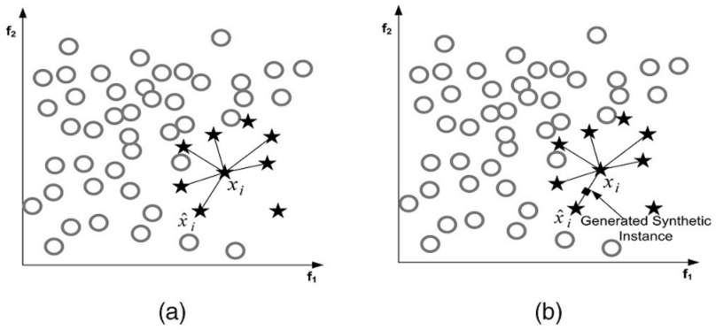

## 0.其他

* 参考资料

[http://www.zhaokv.com/2016/01/learning-from-imbalanced-data.html](http://www.zhaokv.com/2016/01/learning-from-imbalanced-data.html)

[https://github.com/scikit-learn-contrib/imbalanced-learn](https://github.com/scikit-learn-contrib/imbalanced-learn)

[https://florianhartl.com/thoughts-on-machine-learning-dealing-with-skewed-classes.html](https://florianhartl.com/thoughts-on-machine-learning-dealing-with-skewed-classes.html)

* python包

```
# imbalanced-learn # import imblearn
sudo pip install -U imbalanced-learn
```

## 1.采样\(Sampling\)

### 1.1.Under-sampling

将数据多的类进行欠采样，即去掉一部分数据，使各类数据平衡

### 1.2.Over-sampling

将数据多的类进行欠采样，即合成或者拷贝一些数据，使各类数据平衡。数据合成方法是利用已有样本生成更多样本，这类方法在小数据场景下有很多成功案例，比如医学图像分析等。

#### 1.2.1.Random minority over-sampling with replacement

在已有的点中随机的进行拷贝

#### 1.2.2.SMOTE

其中最常见的一种方法叫做SMOTE，它利用小众样本在特征空间的相似性来生成新样本。对于小众样本 $$x_i\in S_{\min}$$ ，从它属于小众类的K近邻中随机选取一个样本点$$\hat{x}_i$$ ，生成一个新的小众样本 $$x_{new}=x_i+(\hat{x}-x_i)\times\delta$$，其中 $$\delta\in[0,1]$$ 是随机数。



上图是SMOTE方法在 \(K=6\) 近邻下的示意图，黑色方格是生成的新样本。

SMOTE为每个小众样本合成相同数量的新样本，这带来一些潜在的问题：一方面是增加了类之间重叠的可能性，另一方面是生成一些没有提供有益信息的样本。为了解决这个问题，出现两种方法：Borderline-SMOTE与ADASYN。

#### 1.2.3.Borderline-SMOTE\(1 & 2\)

#### 1.2.4.SVM SMOTE

#### 1.2.5.ADASYN

ADASYN的解决思路是根据数据分布情况为不同小众样本生成不同数量的新样本，为更难学习的样本点生成更多的点。首先根据最终的平衡程度设定总共需要生成的新小众样本数量$$G$$ ，然后为每个小众样本$$x_i$$计算分布比例$$r_i=\frac{\Delta_i/K}{Z}$$ ，其中$$\Delta_i$$是$$x_i$$K近邻中大众样本的数量，$$Z$$用来归一化使得$$\sum r_i=1$$，最后为小众样本$$x_i$$生成新样本的个数为$$g_i=r_i\times G$$，确定个数后再利用SMOTE生成新样本。

### 1.3.Over-sampling followed by under-sampling

上采样和下采样同时进行

### 1.4.Ensemble-sampling

对样本进行\(多次\)下采样，用集成的方式进行学习

## 2.评判标准\(Metrics\)

考虑选取precision、recall、f1、roc\_auc、cohen's kappa等。  
一般要在precision和recall之间进行权衡，一个变高另一个一般就会变低。

## 3.原始数据分层采样\(Stratified Sampling\)

将数据分成train、validation、test集的时候，进行分层抽样。数据原本就不太平衡了，在分割数据集的时候很容易造成数据更加不平衡。

## 4.阈值移动\(Threshold Moving\)

我们通常将$$y > 0.5$$判别为正例，$$y$$实际上表达了正例的可能性，几率$$\frac{y}{1-y}$$则反映了正例的可能性与反例可能性之比值，阈值设置为0.5恰好表明分类器认为真实正、反例可能性相同，我们可以调整$$y > threshold$$来控制正、反例的可能性。

## 5.各类别权重\(Class Weight\)

大多数分类器都有class\_weight这个参数，代表了各类别的重要程度，对class\_weight调参，获得更合理的权重系数。

## 6.一分类\(One Class Learning\)

把问题看做一分类\(One Class Learning\)或者异常检测\(Novelty Detection\)问题，对其中一种分类建模，模型会划出一片封闭的区域，在区域中的点视为同一类，不在区域内的点视为不同区域的点。

## 99.个人感想

* 不平衡数据中ROC\_Curve的用处并没有想象中大，而PR\_Curve更加有用

  参考：[https://classeval.wordpress.com/reanalysis-of-a-previous-study/](https://classeval.wordpress.com/reanalysis-of-a-previous-study/)


