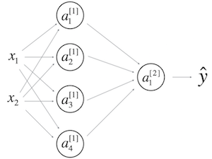
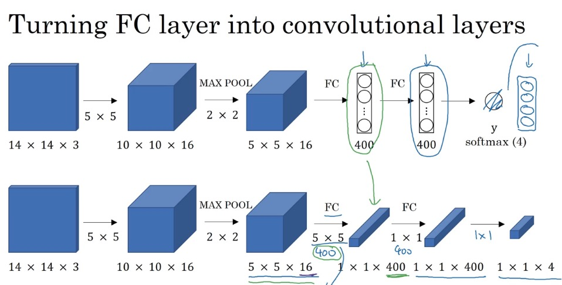
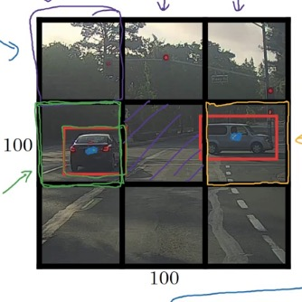
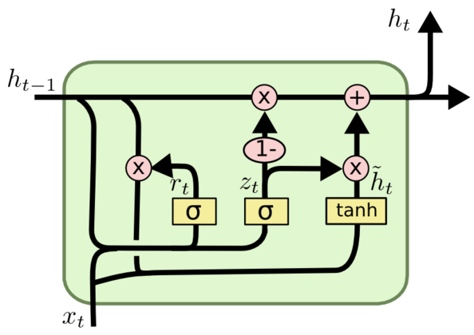
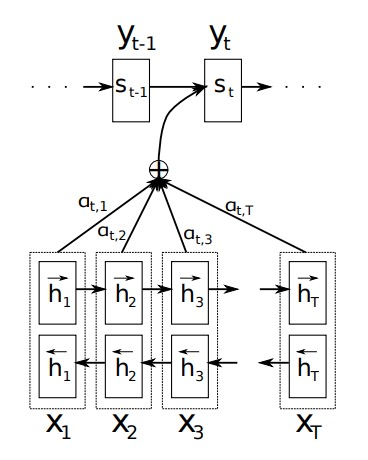

## forward/backward propagation



* **notation**

  $$n^{[i]}$$: 代表第i层的节点数，i=0代表输入特征数

  $$m$$: 代表训练的样本数

  $$W^{[i]}$$: 代表第i-1层到第i层的权值，大小为$$(n^{[i]}, n^{[i-1]})$$

  $$b^{[i]}$$: 代表第i-1层到第i层的偏置，大小为$$(n^{[i]}, 1)$$

  $$Z^{[i]}$$: 代表第i层的值，大小为$$(n^{[i]}, m)$$

  $$A^{[i]}$$: 代表第i层节点通过激活函数后的值，大小为$$(n^{[i]}, m)$$，特别的$$A^{[0]}=X$$

  $$g^{[i]}$$: 代表第i层的激活函数

* **forward propagate**

$$
\begin{aligned}
&Z^{[1]}=W^{[1]}X+b^{[1]} \\
&A^{[1]}=g^{[1]}(Z^{[1]}) \\
&Z^{[2]}=W^{[2]}A^{[1]}+b^{[2]} \\
&A^{[2]}=g^{[2]}(Z^{[2]}) \\
\end{aligned}
$$

* **back propagate**

$$
\begin{aligned}
&\frac{\partial{J}}{\partial{A^{[2]}}} = \frac{\partial{}}{\partial{A^{[2]}}}(-YlogA^{[2]}-(1-Y)log(1-A^{[2]})) (如果是交叉熵损失的话) \\
&\frac{\partial{J}}{\partial{Z^{[2]}}} = \frac{\partial{J}}{\partial{A^{[2]}}} * g^{[2]'}(Z^{[2]}) = A^{[2]}-Y (如果g是sigmoid的话) \\
&\frac{\partial{J}}{\partial{W^{[2]}}} = \frac{\partial{J}}{\partial{Z^{[2]}}} \cdot A^{[1]T} \cdot \frac{1}{m} \\
&\frac{\partial{J}}{\partial{b^{[2]}}} = \frac{\partial{J}}{\partial{Z^{[2]}}} .sum(axis=1) \\
&\frac{\partial{J}}{\partial{A^{[1]}}} = W^{[2]T} \cdot \frac{\partial{J}}{\partial{Z^{[2]}}} \\
&\frac{\partial{J}}{\partial{Z^{[1]}}} = \frac{\partial{J}}{\partial{A^{[1]}}} * g^{[1]'}(Z^{[1]}) \\
&\frac{\partial{J}}{\partial{W^{[1]}}} = \frac{\partial{J}}{\partial{Z^{[1]}}} \cdot A^{[0]T} \cdot \frac{1}{m} \\
&\frac{\partial{J}}{\partial{b^{[1]}}} = \frac{\partial{J}}{\partial{Z^{[1]}}} .sum(axis=1) \\
\end{aligned}
$$

## W初始化问题

* 有隐藏层

  W不能都初始化为0，因为这样会使$$A^{[1]} = 0$$，继而使$$\frac{\partial{J}}{\partial{W^{[2]}}} = \frac{\partial{J}}{\partial{Z^{[2]}}} \cdot A^{[1]T} \cdot \frac{1}{m} = 0$$，则$$W^{[2]}$$不会变，$$W^{[1]}$$同样，无论进行几次迭代都一样

* 无隐藏层

  W可以初始化为0，因为即使W为0，$$\frac{\partial{J}}{\partial{W^{[1]}}} = \frac{\partial{J}}{\partial{Z^{[1]}}} \cdot A^{[0]T} \cdot \frac{1}{m}$$也不会为0，它直接取决于$$X$$

* 梯度消失/爆炸

  在很深的网络中，很容易造成梯度消失或者梯度爆炸，合理的初始化W，能使这种情况减缓。

  直观感受（不严谨的），每层得到的值都比1大一些，比如1.5，到最后这个值就会爆炸；每层得到的值都比1小一些，比如0.5，到最后这个值就会消失。所以尽量让每层的值更靠近1，那么让z=w1x1+w2x2+...+xnxn尽量为1的方法，可以让wi=1/n

* 推荐的初始化

  初始化为一个比较小的值（太大会导致学习很慢）

  $$W^{[l]} = np.random.rand(shape) * np.sqrt(\frac{1}{n^{[n-1]}})$$

  如果激活函数是relu，一般后面的项为$$np.sqrt(\frac{2}{n^{[n-1]}})$$  
  如果激活函数是tanh，一般后面的项为$$np.sqrt(\frac{1}{n^{[n-1]}})$$  
  还有其他的选择，如$$np.sqrt(\frac{2}{n^{[n-1]}+n^{[n]}})$$

  在实际运用中可以作为超参，比较哪种初始化好

## 梯度下降优化
-----

* momentum

  直观解释，球会受到前面下降的影响，有一些惯性；另外，如果某个方向波动的厉害，那么momentum能很好的处理这种情况，

  初始化，$$v_{dW}=0$$，$$t$$为第几个周期

  每次迭代，  
  $$v_{dW}=\beta_1 v_{dW} + (1-\beta_1) dW$$  
  $$v_{dW}^{corrected}=\frac{1}{1-\beta_1^t} v_{dW}$$（偏差修正，一般在momentum不作修正）  
  $$W = W - \alpha . v_{dW}$$

  关于偏差修正：在刚开始迭代的时候，v为0，接下来几次v都会非常小，偏差修正是为了纠正这个误差

* RMSprop

  直观解释，不同方向梯度尺度不同，而学习率是同一个，所以球位移很大的方向，需要给予抑制

  初始化，$$s_{dW}=0$$

  每次迭代，  
  $$s_{dW}=\beta_2 s_{dW} + (1-\beta_2) dW^2$$  
  $$s_{dW}^{corrected}=\frac{1}{1-\beta_2^t} s_{dW}$$（偏差修正，一般不用）  
  $$W = W - \alpha . \frac{dW}{\sqrt{s_{dW}} + \epsilon}$$

* Adam

  直观解释，momentum和RMSprop的结合

  初始化，$$v_{dW}=0$$，$$s_{dW}=0$$

  每次迭代，  
  $$v_{dW}=\beta_1 v_{dW} + (1-\beta_1) dW$$  
  $$v_{dW}^{corrected}=\frac{1}{1-\beta_1^t} v_{dW}$$  
  $$s_{dW}=\beta_2 s_{dW} + (1-\beta_2) dW^2$$  
  $$s_{dW}^{corrected}=\frac{1}{1-\beta_2^t} s_{dW}$$  
  $$W = W - \alpha . \frac{v_{dW}^{corrected}}{\sqrt{s_{dW}^{corrected}} + \epsilon}$$


## Overfitting
-----

过拟合原因：数据太少 or 模型太复杂

### DropOut

### L1 / L2

### early stopping

### add datasets

* data argumentation

### Batch Normalization

每层的$$Z^{[l]}$$都进行归一化后得到$$\tilde{Z}^{[l]}$$后再计算$$A^{[l]}$$

* 使每层在训练的时候更稳定，由于每层都做过归一化，即使训练数据变化比较大，归一化后它的分布也不会变化很大，大概意思就是减少了层与层直接的耦合

* 具有轻微的正则化效果（不过这个不重要，正则化不是BN的目的）

  公式：  
  $$\mu = \frac{1}{m} \sum\limits_{i} z^{(i)}$$  
  $$\sigma^{2} = \frac{1}{m} \sum\limits_{i}(z^{(i)}-\mu)^2$$  
  $$z^{(i)}_{norm} = \frac{z^{(i)}-\mu}{\sqrt{\sigma^2 + \epsilon}}$$  
  $$\tilde{z}^{(i)} = \gamma z^{(i)}_{norm} + \beta$$

  其中，$$\gamma$$和$$\beta$$也在梯度下降的时候进行更新（像W和b一样）

## 经典的CNN
-----


* LeNet \(1986\)

  首次使用卷积、池化、全连接层得到很好的效果，在此之后CNN沉寂了十几年

* AlexNet \(2012\)

  更复杂的CNN，使用了GPU，让CNN和GPU火了起来

* GoogLeNet \(2014\)

  多个卷积结果concat  
  1×1 CONV  
  由Inception块，每个块后面都有输出

* VGG \(2014\)

  更深的卷积、池化、全连接层。。计算量巨大（结构其实不复杂）

* ResNet \(2016\)

  Res block（高宽不变）和Conv block（高宽变小），使得CNN能够更深，不易出现梯度消失/爆炸  
  Res block更容易学习为Identity function

## 目标探测\(object detection\)
-----

### Sliding Windows

首先将FC层转换成卷积层，这个转换实际上是等效的，因为下面的filter是5×5×16的，实际上就是线性相乘，然后得到一个值，400个filters就是400个值



接下来直接将原图放到网络中，这样可以同时对四个块进行计算，节省的公共部分的计算
而每个块都是共用所有的卷积核的


### YOLO\(Your Only Look Once\)

将图片分成3×3的块进行探测，但注意，不是分别进行预测，而是同时预测

假设输出的$$y=[p_c,b_x,b_y,b_h,b_w,c_1,c_2,c_3]$$，  
其中，分别代表：框内是否有物体，中心x，中心y，物体高，物体宽，是否为行人，是否为车，是否为摩托车

那么，一张子图片最终输出的shape为1×1×8，  
分成3×3后的输出为3×3×8，然后一起训练/预测



### IoU(Intersection over Union)

 计算两个框重合度的方法
 $$IoU=\frac{A \cap B}{A \cup B}$$

### Non-max suppression

 对一个图预测后，会得到很多框，该如何去确定哪些框要留下

 1.首先去掉$$P_c$$太低的，也就是有物体概率低的框
 
 2.选取剩下框中，概率最高的，代表这个框有物体，然后去掉跟这个框重合度高的；这个步骤循环进行


### Faster Alogrithms

Propose regions是指大致找出物体所在位置

**R-CNN**: Propose regions(traditional segmentation algorithms). Classify proposed regions one at a time. Output label + bounding box.
候选框 + 缩放 + CNN提取特征 + SVM

**Fast R-CNN**: Propose regions. User convolution implementation of sliding windows to classify all the proposed regions.
候选框 + ROI pooling + CNN

**Faster R-CNN**: Use convolutional network to propose regions.
整图进CNN+PRN（Region Proposal Networks，archorBox + softmax）+ softmax


## Nerual Style Transfer
-----

### cost function

C代表content图片，S代表style图片，G代表generate图片

* content cost function

评判内容是否接近的标准是某一层C和G的激活值是否接近

$$J_{content}(C,G) =  \frac{1}{4 \times n_H \times n_W \times n_C}\sum _{ \text{all entries}} (a^{(C)} - a^{(G)})^2$$

* style cost function

这里使用gram matrix来衡量style，具体的，它代表了每个filter之间相关程度，对角线呈现了每个filter自身的一个评判（大概是这个意思，并没有一个推导，不过实际应用起来效果不错）

$$
\begin{aligned}
&{\displaystyle G_{ij} = v_{i}^T v_{j} = np.dot(v_{i}, v_{j})  } \\
&J_{style}^{[l]}(S,G) = \frac{1}{4 \times {n_C}^2 \times (n_H \times n_W)^2} \sum _{i=1}^{n_C}\sum_{j=1}^{n_C}(G^{(S)}_{ij} - G^{(G)}_{ij})^2 \\
&J_{style}(S,G) = \sum_{l} \lambda^{[l]} J^{[l]}_{style}(S,G) \\
\end{aligned}
$$

* total cost function

$$J(G) = \alpha J_{content}(C,G) + \beta J_{style}(S,G)$$

实际应用中，$$J(C,G)$$使用某一层来做，$$J(S,G)$$使用多层去做，效果更好

## GRU(Gated Recurrent Unit)
-----

### architecture



$$r_t$$代表重置门，$$z_t$$代表更新门

$$
\begin{aligned}
&r_t = \sigma (W_r [h_{t-1},x_t] + b_r) \\
&z_t = \sigma (W_z [h_{t-1},x_t] + b_z) \\
&new memory: \tilde{h_t} = tanh(W_h [r_t * h_{t-1},x_t] + b_h) \\
&hidden state: h_t = z_t * \tilde{h_t} + (1-z_t) * h_{t-1} \\
\end{aligned}
$$

直观上讲一下更新门$$z_t$$，如果它接近于0，则保留$$\tilde{h_t}$$，$$\tilde{h_t}$$可以理解为memory；如果它接近于1，则保留$$h_{t-1}$$，即上一个hidden state

## LSTM(Long Short Term Memory)
-----

### architecture


遗忘门$$f_t = \sigma (W_f [h_{t-1},x_t] + b_f)$$

输入门$$i_t = \sigma (W_i [h_{t-1},x_t] + b_i)$$

new memory $$\tilde{C_t} = tanh(W_C [h_{t-1},x_t]) + b_C)$$

记忆单元$$C_t = f_t * C_{t-1} + i_t * \tilde{C_t}$$

输出门$$o_t = \sigma (W_o [h_{t-1},x_t] + b_o)$$

输出(hidden state)$$h_t = o_t * tanh(C_t)$$

## text translate(Seq2Seq)
-----


前面一半是encode过程，后面一半是decode过程，先将要翻译的文本通过encode块，再通过decode块生成目标语言

### Beam Search

假设beam_width B=3，

在生成第一个单词时，保留3个可能性最高的单词
在生成第二个单词时，计算出上面得到的3个单词乘上第二个单词的概率，得到单词对(单词1, 单词2)的备选概率，选最高的3个
重复上述操作

### Attention Model

大致思路就是在生成一个单词时，不仅注意前一个单词，也注意X每个单词




## Speech Recognition

### CTC (Connectionist Temporal Classification)

将RNN预测出的语音（讲的内容，会很长，好几个时间单位都在一个字母上），转化成正常单词

```
__c_oo_o_kk___b_ooooo__oo__kkk
->
cookbook
```
