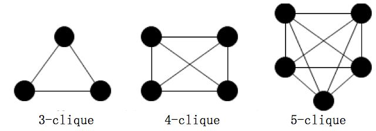

# Social Network Analysis ( SNA )

* **社区（Community），非重叠社区，重叠社区**

社区可以理解成UML中的群组，也就是同一个社区中节点和节点关系紧密，而社区和社区之间关系稀疏。

如果任意两个社区的节点集合的交集为空则被称为非重叠社区，否则称为重叠社区。

* **派系（Clique），完全子图**

派系是指任意两个点都相连的节点的集合，又称为完全子图。

# 分析方法

## Individual Behavior

### 分析思路

* User-User Behavior

  加好友

* User-Community Behavior

  用户加入一个讨论群；也可以看做，一群人买了某个商品是一个社区，怎么让没买的人加入

* User-Entity Behavior

  比如，发表文章

### Individual Behavior Modeling

* Threshold models(Chapter 8).

* Cascade Models (Chapter 7).

### Individual Behavior Prediction

* Link Prediction

  当前有一个图，预测接下来图会变成什么样（加入/去掉边）

* Node Neighborhood-Based Methods

  两点近似度
  
* Methods Based on Paths between Nodes

  两点间的路径
  
## Collective Behavior Analysis

* User Migration in Social Media

  Site Migration: 刚开始用户是两个site的成员，在下一个时刻，他仅为s2的成员，就是从s1迁移到s2
  
  Attention Migration: 刚开始用户是两个site的活跃成员，在下一个时刻，他仅在s2活跃，就从s1迁移到s2

