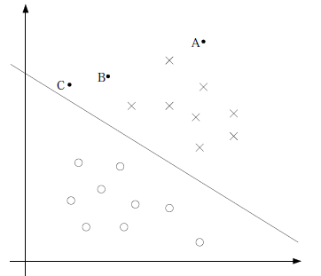
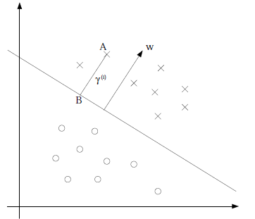
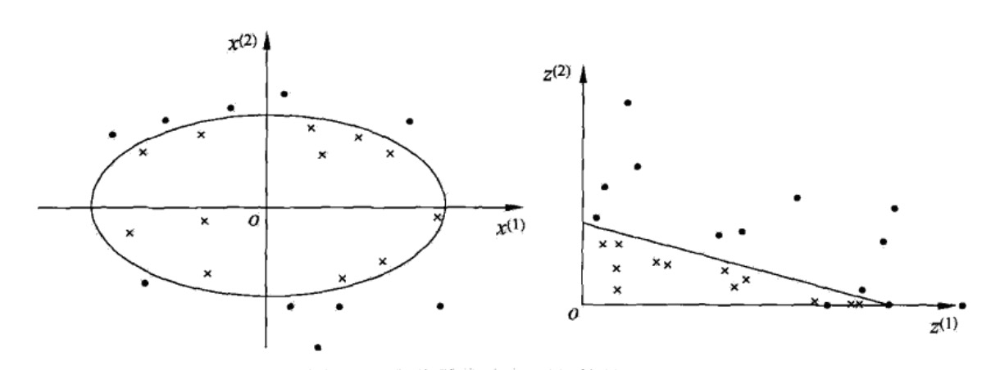
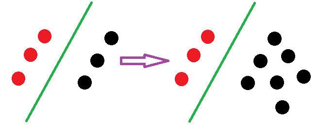
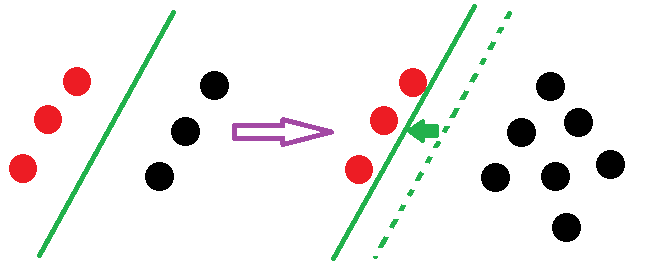

## 拉格朗日对偶性

**原始问题** 
$$
\begin{aligned}
&\min \quad f(x) \\
&s.t. \quad c_i(x) \le 0, \quad i=1,2,...,k \\
&\qquad \quad h_j(x) = 0, \quad j=1,2,...,l  \\
\end{aligned}
$$

引进拉格朗日函数，
$$L(x, \alpha, \beta)=f(x) + \sum\limits^k_{i=1}\alpha_i c_i(x) + \sum\limits^l_{j=1}\beta_j h_j(x)$$
这里，$$\alpha_i \ge 0$$

考虑函数，
$$\theta_P(x) = \max\limits_{\alpha , \beta} L(x, \alpha, \beta)$$
这里$$P$$代表原始问题

求解原问题，即求解
$$\min\limits_{x} \theta_P(x) = \min\limits_{x} \max\limits_{\alpha , \beta} L(x, \alpha, \beta)$$

定义原始问题的最优解
$$p^* = \min\limits_{x} \theta_P(x)$$

**对偶问题**
$$\theta_D(\alpha, \beta) = \min\limits_{\alpha, \beta}L(x, \alpha, \beta)$$
这里$$D$$代表对偶问题

对偶问题的最优解，
$$d^* = \theta_D(\alpha, \beta)$$

**原始问题和对偶问题的关系**

$$d^* \le p^*$$

**KKT条件**

满足KKT条件时，$$d^* = p^*$$

## 线性可分支持向量机（硬间隔最大化）

下图中的三个点，A距离分类边界很远，我们可以很确定A是X类；而C距离分类边界很近了，它属于X类的确信度就不是很高了；而B在AC之间，确信度也在AC之间。所以我们想让离分类边界最近的点，尽可能离分类边界远

我们定义函数间隔：
$$\hat\gamma_i = |wx_i+b| = y_i(wx_i+b)$$

几何间隔：
$$\gamma_i = \frac{|wx_i+b|}{\lVert w \rVert} = \frac{y_i(wx_i+b)}{\lVert w \rVert}$$

它们之间的关系是：
$$\gamma_i = \frac{\hat\gamma_i}{\lVert w \rVert}$$

我们先假设数据线性可分，基于上面的想法，我们想让离分类边界（几何间隔）最近的点，尽可能离分类边界远，也就是使，

$$
\begin{aligned}
&\max \quad \gamma \\
&s.t. \quad \frac{y_i(wx_i+b)}{\lVert w \rVert} \ge \gamma 
\end{aligned}
$$

转化成函数间隔后，

$$
\begin{aligned}
&\max \quad \frac{\hat\gamma}{\lVert w \rVert} \\
&s.t. \quad y_i(wx_i+b) \ge \hat\gamma 
\end{aligned}
$$

由于我们求$$\frac{\hat\gamma}{\lVert w \rVert}$$最大时，$$\hat\gamma$$的取值不会影响这个最优化问题，所以我们取$$\hat\gamma=1$$，则最优化问题变成了，

$$
\begin{aligned}
&\min \quad \frac{1}{2}\lVert w \rVert^2 \\
&s.t. \quad y_i(wx_i+b) \ge 1 
\end{aligned}
$$

根据这个最优化问题，我们列出拉格朗日函数，
$$L(w,b,\alpha) = \frac{1}{2}\lVert w \rVert^2 + \sum\limits^N_{i=1}\alpha_i [y_i(wx_i+b)-1] $$

那么，原问题就是，
$$p^* = \min\limits_{w,b} \max\limits_{\alpha} L(w,b,\alpha)$$

它的对偶问题是，
$$d^* = \max\limits_{\alpha} \min\limits_{w,b} L(w,b,\alpha)$$

由于优化问题满足KKT条件，所以可以直接求解对偶问题
那么我们先求$$\min\limits_{w,b} L(w,b,\alpha)$$

$$
\frac{\partial L(w,b,\alpha)}{\partial w} = w - \sum\limits^N_{i=1}\alpha_i y_i x_i = 0 \\
\frac{\partial L(w,b,\alpha)}{\partial b} = - \sum\limits^N_{i=1}\alpha_i y_i = 0 \\
$$

得到，
$$
w = \sum\limits^N_{i=1}\alpha_i y_i x_i \\
\sum\limits^N_{i=1}\alpha_i y_i = 0 \\
$$

代入$$L(w,b,\alpha)$$中，得到
$$L(w,b,\alpha) = \sum\limits^N_{i=1}\alpha_i - \frac{1}{2} \sum\limits^N_{i=1} \sum\limits^N_{j=1} \alpha_i \alpha_j y_i y_j x_i x_j$$

然后再进行极大化过程，
$$
\begin {aligned}
&\max \quad \sum\limits^N_{i=1}\alpha_i - \frac{1}{2} \sum\limits^N_{i=1} \sum\limits^N_{j=1} \alpha_i \alpha_j y_i y_j x_i x_j \\
&s.t. \quad \sum\limits^N_{i=1}\alpha_i y_i = 0 \\
&\qquad \quad \alpha_i \ge 0, i=1,2,...,N 
\end{aligned}
$$

根据上式可以求得$$a^*$$，则可以进一步求得$$w^*,b^*$$

最终决策函数为，
$$f(x) = sign(\sum\limits^N_{i=1} \alpha_i^* y_i (x\bullet x_i)+b^*)$$

## 线性支持向量机（软间隔最大化）

对于实践中的数据，很多时候都是线性不可分的，所以这时候我们引入一个松弛因子$$\xi$$，则点的约束条件变成了，
$$\hat\gamma_i = y_i(wx_i+b) \ge 1-\xi_i$$

这时候优化问题变成了，
$$
\begin {aligned}
&\min \quad \frac{1}{2}\lVert w \rVert^2 + C\sum\limits^N_{i=1}\xi_i \\
&s.t. \quad y_i(wx_i+b) \ge 1 
\end{aligned}
$$

求解后得到，
$$
\begin {aligned}
&\max \quad \sum\limits^N_{i=1}\alpha_i - \frac{1}{2} \sum\limits^N_{i=1} \sum\limits^N_{j=1} \alpha_i \alpha_j y_i y_j x_i x_j \\
&s.t. \quad \sum\limits^N_{i=1}\alpha_i y_i = 0 \\
&\qquad \quad 0 \le \alpha_i \le C, i=1,2,...,N 
\end{aligned}
$$
可以看到，$$\xi$$不见了，它比线性可分支持向量机多了一个$$\alpha_i \le C$$
不过需要注意的是$$b^*$$的公式也变了

## 非线性支持向量机（核技巧）

可以看到下图中的数据，可以用一个椭圆形的分类边界将数据分类，
也就是将原来的$$x$$映射到二维$$z=x^2$$可以将数据很好的分割

根据上面的思路，我们将$$x$$映射到更高维，$$\phi(x)$$，
则$$wx+b$$就变成了$$w\phi(x)+b$$

**核函数**

我们定义核函数$$K(x,z)=\phi(x)\bullet\phi(z)$$

我们看个例子，假设核函数$$K(x,z)=(x\bullet z)^2$$，$$x,z$$均是2维的，
那么$$\phi(x)=((x^{(1)})^2, \sqrt{2}x^{(1)}x^{(2)}, (x^{(2)})^2)$$，可以使得核函数成立

那这个时候，我们就可以不用求$$\phi$$具体是什么，只要直接使用$$K(x,z)$$

当然核函数需要满足一定条件才能这么干，常用的核函数有，
多项式核函数：$$K(x,z)=(x\bullet z+1)^p$$
高斯径向基函数：$$K(x,z)=exp(-\frac{||x-z||^2}{2\sigma^2})$$

**在SVM中使用**

决策函数为，
$$f(x) = sign(\sum\limits^N_{i=1} \alpha_i^* y_i (x\bullet x_i)+b^*)$$

我们映射到高维，
$$f(x) = sign(\sum\limits^N_{i=1} \alpha_i^* y_i (\phi(x)\bullet \phi(x_i))+b^*)$$

转化成核函数，
$$f(x) = sign(\sum\limits^N_{i=1} \alpha_i^* y_i K(x, x_i)+b^*)$$

## SVM对比Logistic Regression

1、SVM只关心一部分点，而LR关心所有的点

SVM增加点后的状况

LR增加点后的状况

