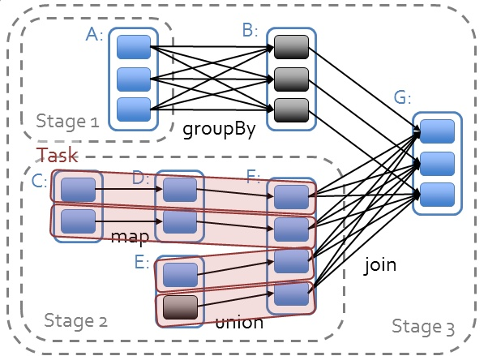

## 参考

http://litaotao.github.io/introduction-to-spark

### master, slave

master服务(YARN ResourceManager,Mesos master和Spark standalone master)决定哪些application可以运行，什么时候运行以及哪里去运行。而slave服务( YARN NodeManager, Mesos slave和Spark standalone slave)实际上运行executor进程。

### 任务分配

**job** : A job is triggered by an action, like count\(\) or saveAsTextFile\(\). Click on a job to see information about the stages of tasks inside it. 

**stage** : stage 是一个 job 的组成单位，就是说，一个 job 会被切分成 1 个或 1 个以上的 stage，然后各个 stage 会按照执行顺序依次执行（以shuffle为界进行切分stage）

**task** : A unit of work within a stage, corresponding to one RDD partition。即 stage 下的一个任务执行单元，一般来说，一个 rdd 有多少个 partition，就会有多少个 task，因为每一个 task 只是处理一个 partition 上的数据。从 web ui 截图上我们可以看到，这个 job 一共有 2 个 stage，66 个 task，平均下来每个 stage 有 33 个 task，相当于每个 stage 的数据都有 33 个 partition \[注意：这里是平均下来的哦，并不都是每个 stage 有 33 个 task，有时候也会有一个 stage 多，另外一个 stage 少的情况，就看你有没有在不同的 stage 进行 repartition 类似的操作了。

## action, transformation

判断结果会不会发到driver上，发到driver上的是action。比如reduce会产生一个结果发到driver上，就是action；reduceByKey对每个key进行操作，并不会发到driver上，就是transformation

## narrow/wide dependences



narrow dependences: C->D，只使用至多一个partition

wide dependences: A->B，需要使用多个partitions，也就是说需要shuffle

## Conf

优先级：代码显示调用set；spark-submit传参；配置文件；系统默认值

```
spark.sql("set spark.sql.shuffle.partitions=200") // 设置sql发生shuffle后形成多少partitions
```

## 代码性能

* 调用函数

 错误的方法会将整个obj都发送到worker上
 
 (关于实例化个人总结：将rdd作为示例的成员是没有问题的，如self.rdd；有问题的是df.map(self.f)这种情形)

```python
### wrong way
class SearchFunctions(object):
  def __init__(self, query):
      self.query = query
  def isMatch(self, s):
      return self.query in s
  def getMatchesFunctionReference(self, rdd):
      # Problem: references all of "self" in "self.isMatch"
      return rdd.filter(self.isMatch)
  def getMatchesMemberReference(self, rdd):
      # Problem: references all of "self" in "self.query"
      return rdd.filter(lambda x: self.query in x)
### the right way
class WordFunctions(object):
  ...
  def getMatchesNoReference(self, rdd):
      # Safe: extract only the field we need into a local variable
      query = self.query
      return rdd.filter(lambda x: query in x)
```

* broadcast

https://blog.csdn.net/dengxing1234/article/details/74330768

## CPU/Memory设置

http://blog.cloudera.com/blog/2015/03/how-to-tune-your-apache-spark-jobs-part-2/

https://spark.apache.org/docs/latest/tuning.html

### tasks

tasks数量是根据源数据的partition数量来的

**tasks过少时**

可能会导致executors跑不满（有些executeors闲置）

可能会导致，数据无法完全的放入到memory中（每个executors执行的tasks数量少，但是每次执行tasks所需内存大）

**如何设置**

通过实验的方式得到partitons数量，先用一个较小的值，每次*1.5，直到性能没有提升

## Spark Streaming

https://www.cnblogs.com/Dhouse/p/7615034.html

## TODO

怎么查看每个tasks是否完全放入到memory中