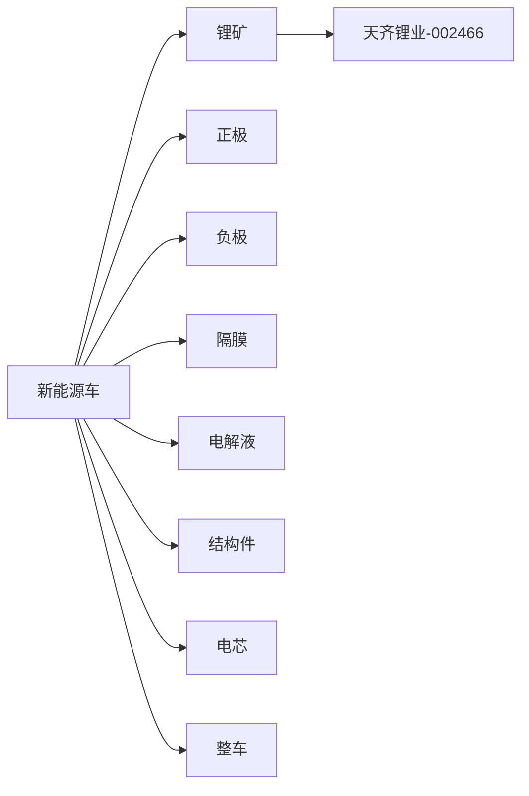

# 产业链思维导图

```mermaid
flowchart LR;
    XinNengYuanChe[新能源车]-->LiKuang[锂矿];
    XinNengYuanChe[新能源车]-->ZhengJi[正极];
    XinNengYuanChe[新能源车]-->FuJi[负极];
    XinNengYuanChe[新能源车]-->GeMo[隔膜];
    XinNengYuanChe[新能源车]-->DianJieYe[电解液];
    XinNengYuanChe[新能源车]-->JieGouJian[结构件];
    XinNengYuanChe[新能源车]-->DianXin[电芯];
    XinNengYuanChe[新能源车]-->ZhengChe[整车];

    LiKuang[锂矿]-->Stock002466[天齐锂业-002466];
```
